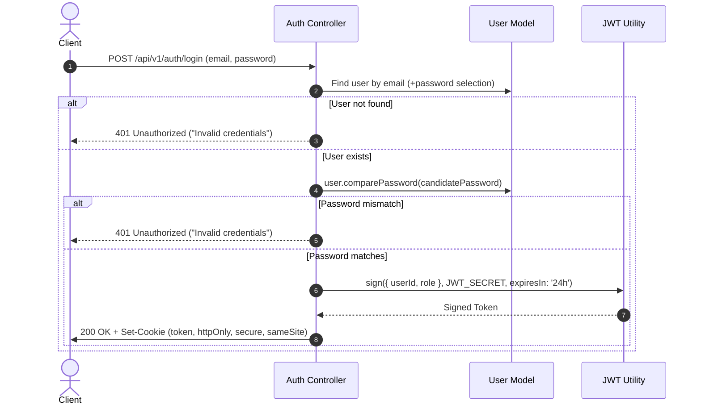
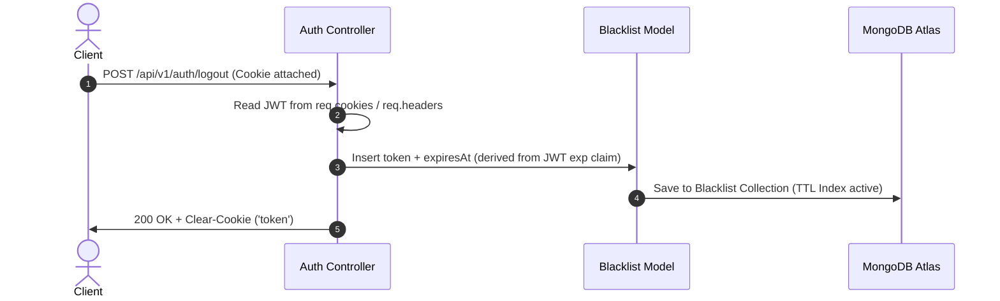
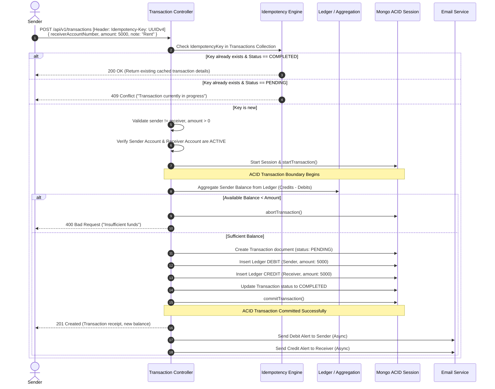

# Feature Specification: Complete Production-Grade Banking Backend API

**Feature Branch**: `feature/banking-backend-api`  
**Specification File**: `.specify/specs/banking-backend-api/spec.md`  
**Created**: 2026-09-14  
**Status**: Ready for Planning / Implementation  
**Tech Stack**: Node.js, Express.js, MongoDB (Atlas/Mongoose), dotenv, bcrypt, jsonwebtoken, cookie-parser, nodemailer, Postman

---

## 1. Project Goal & High-Level Overview

The primary goal of this project is to build a robust, secure, and production-style Banking Backend API designed for educational mastery and real-world system architecture. 

Unlike typical CRUD applications, a banking system demands **strict financial consistency, auditable double-entry accounting, distributed transaction atomicity, idempotent request safety, and multi-layered authentication**. 

### Core Educational & Practical Objectives
1. **Financial Integrity**: Transition away from dangerous naive patterns (e.g., directly incrementing/decrementing a `balance` field in a user document) toward an **immutable double-entry ledger system** where balance is a derived mathematical state.
2. **ACID Transactions**: Master multi-document distributed transactions in MongoDB using Mongoose sessions (`session.startTransaction()`) to guarantee that operations either succeed entirely or roll back completely with zero data corruption.
3. **Idempotency**: Prevent double-transfers, replay attacks, and duplicate billing caused by network retries using client-supplied idempotency keys.
4. **Defense-in-Depth Security**: Implement secure authentication using bcrypt password hashing, HTTP-only SameSite cookies, JWT validation, and real-time server-side token revocation via a MongoDB TTL-indexed Blacklist.
5. **Clean System Architecture**: Maintain strict separation of concerns among configuration, models, controllers, routes, middleware, and decoupled asynchronous services (such as email delivery via Nodemailer).

---

## 2. Functional Requirements (FR) Traceability Matrix

Every single topic and feature requested is mapped directly to a formalized Functional Requirement:

| Item # | Topic / Feature | Functional Requirement ID | Description |
|---|---|---|---|
| 1 | MongoDB Compass Overview | **FR-001** | Database and collections must be inspectable and verifiable in MongoDB Compass and Atlas with schema-compliant documents. |
| 2 | MongoDB Connection Setup | **FR-002** | The application MUST connect to MongoDB via Mongoose before starting the Express HTTP listener, gracefully handling connection errors and DNS SRV resolution. |
| 3 | Environment Variables | **FR-003** | Sensitive variables (`PORT`, `MONGO_URI`, `JWT_SECRET`, `SMTP_*`, `COOKIE_SECRET`) MUST be managed strictly through `.env` and `dotenv`. |
| 4 | Database Configuration | **FR-004** | A centralized database configuration module (`src/config/db.js`) MUST manage connection options, pooling, and DNS fallback. |
| 5 | Database Schema Design | **FR-005** | Define strictly typed Mongoose schemas with validation, constraints, and timestamps for `User`, `Account`, `Transaction`, `Ledger`, and `Blacklist`. |
| 6 | Email Validation (Regex) | **FR-006** | Email inputs MUST be validated against RFC 5322 compliant regex and normalized to lowercase before persistence. |
| 7 | Password Hashing (bcrypt) | **FR-007** | Passwords MUST be hashed with a minimum of 10 bcrypt salt rounds prior to saving; plaintext passwords must never be stored or returned. |
| 8 | Password Comparison Method | **FR-008** | The `User` model MUST expose an instance method (`comparePassword`) to verify submitted candidate passwords using `bcrypt.compare`. |
| 9 | Authentication Routes | **FR-009** | Endpoints `POST /api/v1/auth/register` and `POST /api/v1/auth/login` MUST be exposed and routed to dedicated controller functions. |
| 10 | Controllers Implementation | **FR-010** | Controllers MUST remain thin, delegating validation, business logic, session handling, and response formatting cleanly. |
| 11 | JSON Web Token (JWT) | **FR-011** | Successfully authenticated requests MUST generate a signed JWT carrying user identity claims (`userId`, `role`) with explicit expiration. |
| 12 | Cookie Parser Setup | **FR-012** | Express MUST utilize `cookie-parser` to securely read and issue JWT tokens inside HTTP-only, SameSite cookies. |
| 13 | Postman API Testing | **FR-013** | A structured Postman collection with environment variables and automated test scripts MUST validate all success and error paths. |
| 14 | Login API Implementation | **FR-014** | `POST /api/v1/auth/login` MUST authenticate credentials, reject invalid users/passwords with uniform errors, and set the auth cookie. |
| 15 | Nodemailer Setup | **FR-015** | A centralized email configuration (`src/config/email.js`) MUST establish an authenticated SMTP transport. |
| 16 | Email Service Function | **FR-016** | A reusable service (`src/services/email.service.js`) MUST handle compiling and sending asynchronous emails without blocking HTTP threads. |
| 17 | Welcome Email | **FR-017** | Upon successful user registration, a personalized welcome email MUST be dispatched in a fire-and-forget background job. |
| 18 | Account Model | **FR-018** | The `Account` model MUST store user references, a unique 10-digit account number, account status, and currency. |
| 19 | Account Routes | **FR-019** | Endpoints `POST /api/v1/accounts` (create) and `GET /api/v1/accounts/me` (view user accounts) MUST be protected and functional. |
| 20 | Account Controller | **FR-020** | Account controller MUST generate collision-free account numbers, enforce one active primary account per user, and manage statuses. |
| 21 | Authentication Middleware | **FR-021** | `authMiddleware` MUST extract tokens from cookies or Authorization headers, verify token signature, check the blacklist, and populate `req.user`. |
| 22 | Banking System Concepts | **FR-022** | The system MUST adhere to core banking rules: double-entry bookkeeping, conservation of money, and zero-sum ledger entries per transaction. |
| 23 | Transaction Model | **FR-023** | The `Transaction` model MUST record sender, receiver, amount (in minor units), status (`PENDING`, `COMPLETED`, `FAILED`), and idempotency key. |
| 24 | Ledger Model | **FR-024** | The `Ledger` model MUST record atomic journal entries with type (`DEBIT` or `CREDIT`), linked transaction ID, account ID, and timestamp. |
| 25 | Transaction Controller | **FR-025** | Orchestrate money transfers inside a MongoDB transaction session with balance derivation, ledger double-entry creation, and state updates. |
| 26 | Idempotency Validation | **FR-026** | Transactions MUST require an `Idempotency-Key` header. Requests reusing an existing key MUST return the existing transaction record without re-executing. |
| 27 | Idempotency Controller / Logic | **FR-027** | Detect duplicate in-flight requests (return 409 Conflict) vs completed requests (return cached transaction payload). |
| 28 | Account Status Checking | **FR-028** | The system MUST block transactions if either sender or receiver account is not in `ACTIVE` status (e.g., `FROZEN`, `SUSPENDED`, `INACTIVE`). |
| 29 | Derived Balance Aggregation | **FR-029** | The sender's available balance MUST be derived dynamically from the `Ledger` collection using a MongoDB Aggregation Pipeline (`Credits - Debits`). |
| 30 | Transaction Pending State | **FR-030** | Every transaction record MUST be created in a `PENDING` state before ledger entries are committed, updating to `COMPLETED` or `FAILED`. |
| 31 | Transaction Email Alerts | **FR-031** | Both sender (Debit Alert) and receiver (Credit Alert) MUST receive email notifications upon transaction completion. |
| 32 | Create Transaction API | **FR-032** | `POST /api/v1/transactions` MUST accept receiver account, amount, note, and idempotency key, executing the full transactional pipeline. |
| 33 | Fetch Balance API | **FR-033** | `GET /api/v1/accounts/:accountId/balance` MUST return the real-time calculated ledger balance and account status. |
| 34 | Blacklist Model | **FR-034** | `Blacklist` model MUST store invalidated JWT tokens with a MongoDB TTL (Time-To-Live) index that auto-deletes records once expired. |
| 35 | Logout API | **FR-035** | `POST /api/v1/auth/logout` MUST add the caller's JWT to the blacklist and clear the auth cookie. |
| 36 | Production Deployment | **FR-036** | The backend MUST be production-ready: strict CORS, secure cookie flags in production, health check endpoint, and clean PM2/Docker configuration. |

---

## 3. User Roles & Access Model

### Role Determination:
For this backend API, we define two roles:
1. **`CUSTOMER` (Default)**:
   - Registers, logs in, logs out.
   - Automatically owns an `Account`.
   - Views their own account balance, ledger history, and transaction status.
   - Initiates outbound transfers from their own verified accounts.
2. **`SYSTEM / ADMIN` (Internal / Extended)**:
   - System actor used for initial account funding (faucet/treasury deposit).
   - System maintenance, account freeze/unfreeze operations, and auditing.

### Why multi-tiered RBAC is kept streamlined:
Banking customer operations must be strictly partitioned by **Account Ownership** (Object-Level Authorization) rather than broad hierarchical roles. An authenticated customer can only transfer money out of accounts they explicitly own (`account.user.equals(req.user._id)`).

---

## 4. Comprehensive User Flows

### Flow 1: User Registration & Welcome Email
```mermaid
sequenceDiagram
    autonumber
    actor Client
    participant AuthCtrl as Auth Controller
    participant UserMod as User Model
    participant AcctMod as Account Model
    participant EmailSvc as Email Service
    participant DB as MongoDB Atlas

    Client->>AuthCtrl: POST /api/v1/auth/register (name, email, password)
    AuthCtrl->>AuthCtrl: Validate Email Regex & Password Complexity
    AuthCtrl->>UserMod: Check if email exists
    alt Email already registered
        UserMod-->>AuthCtrl: Duplicate found
        AuthCtrl-->>Client: 409 Conflict ("Email already registered")
    else Email unique
        AuthCtrl->>UserMod: Hash password (bcrypt) & Save User
        UserMod->>DB: Insert User document
        AuthCtrl->>AcctMod: Auto-provision Default Savings Account
        AcctMod->>DB: Insert Account (ACTIVE, 10-digit number)
        AuthCtrl->>EmailSvc: Trigger sendWelcomeEmail(user.email, user.name) [Async]
        AuthCtrl-->>Client: 201 Created (User details, Account Number, message)
        Note over EmailSvc,DB: Email sent in background; does not block response
    end
```

### Flow 2: User Login & Session Cookie Issuance


### Flow 3: Logout & Server-Side Token Blacklisting


### Flow 4: Complete Transaction Lifecycle (With Idempotency & ACID Ledger)


---

## 5. Database Design & Mongoose Schemas

### Representation of Monetary Values: The Zero-Precision Financial Standard
> [!IMPORTANT]
> **Floating-Point Hazard in Financial Systems**: In JavaScript and standard IEEE-754 floating-point arithmetic, operations like `0.1 + 0.2` equal `0.30000000000000004`. Storing money as floats causes catastrophic rounding errors over time.
> **Production Standard**: All monetary values in this system MUST be stored as **positive 64-bit integers representing the lowest currency denomination (minor units, e.g., Cents, Paisa)**.  
> E.g., `$10.50` is stored as integer `1050`.  
> Conversion helper functions: `toCents(decimalString)` and `toDollars(centsInt)`.

---

### Model 1: `User` (`src/models/user.model.js`)
Represents the individual or entity holding banking credentials.

```javascript
const userSchema = new mongoose.Schema(
  {
    name: {
      type: String,
      required: [true, "Full name is required"],
      trim: true,
      minlength: [2, "Name must be at least 2 characters"],
      maxlength: [100, "Name cannot exceed 100 characters"]
    },
    email: {
      type: String,
      required: [true, "Email address is required"],
      unique: true,
      lowercase: true,
      trim: true,
      match: [
        /^[a-zA-Z0-9._%+-]+@[a-zA-Z0-9.-]+\.[a-zA-Z]{2,}$/,
        "Please provide a valid email address"
      ],
      index: true
    },
    password: {
      type: String,
      required: [true, "Password is required"],
      minlength: [8, "Password must be at least 8 characters"],
      select: false // Never returned in normal queries
    },
    role: {
      type: String,
      enum: ["CUSTOMER", "ADMIN"],
      default: "CUSTOMER"
    },
    isEmailVerified: {
      type: Boolean,
      default: false
    }
  },
  {
    timestamps: true,
    versionKey: false
  }
);
```
- **Indexes**: `{ email: 1 }` (Unique).
- **Hooks**: `pre('save')` hashes password via `bcrypt.hash(this.password, 10)` if modified.
- **Methods**: `comparePassword(candidatePassword)` returns `Promise<boolean>`.

---

### Model 2: `Account` (`src/models/account.model.js`)
Represents the banking repository owned by a user. Notice that **NO mutable `balance` field is stored here**.

```javascript
const accountSchema = new mongoose.Schema(
  {
    user: {
      type: mongoose.Schema.Types.ObjectId,
      ref: "User",
      required: true,
      index: true
    },
    accountNumber: {
      type: String,
      required: true,
      unique: true,
      length: 10,
      index: true
    },
    accountType: {
      type: String,
      enum: ["SAVINGS", "CHECKING"],
      default: "SAVINGS"
    },
    currency: {
      type: String,
      enum: ["USD", "EUR", "PKR", "GBP"],
      default: "USD",
      uppercase: true
    },
    status: {
      type: String,
      enum: ["ACTIVE", "INACTIVE", "SUSPENDED", "FROZEN"],
      default: "ACTIVE",
      index: true
    }
  },
  {
    timestamps: true,
    versionKey: false
  }
);
```
- **Indexes**: `{ accountNumber: 1 }` (Unique), `{ user: 1, accountType: 1 }`.
- **Relationship**: 1 User -> N Accounts (default: 1 User has 1 Primary Account).

---

### Model 3: `Transaction` (`src/models/transaction.model.js`)
Represents the business intent and lifecycle of a fund transfer.

```javascript
const transactionSchema = new mongoose.Schema(
  {
    idempotencyKey: {
      type: String,
      required: [true, "Idempotency-Key is required"],
      unique: true,
      index: true,
      trim: true
    },
    senderAccount: {
      type: mongoose.Schema.Types.ObjectId,
      ref: "Account",
      required: true,
      index: true
    },
    receiverAccount: {
      type: mongoose.Schema.Types.ObjectId,
      ref: "Account",
      required: true,
      index: true
    },
    amount: {
      type: Number, // Stored in minor units (e.g. cents, 1000 = $10.00)
      required: [true, "Transaction amount is required"],
      min: [1, "Amount must be at least 1 minor unit (0.01)"],
      validate: {
        validator: Number.isInteger,
        message: "Amount must be an integer in minor units"
      }
    },
    currency: {
      type: String,
      default: "USD",
      uppercase: true
    },
    status: {
      type: String,
      enum: ["PENDING", "COMPLETED", "FAILED"],
      default: "PENDING",
      index: true
    },
    failureReason: {
      type: String,
      default: null
    },
    note: {
      type: String,
      maxlength: [255, "Note cannot exceed 255 characters"],
      trim: true
    }
  },
  {
    timestamps: true,
    versionKey: false
  }
);
```
- **Indexes**: `{ idempotencyKey: 1 }` (Unique), `{ senderAccount: 1, createdAt: -1 }`, `{ receiverAccount: 1, createdAt: -1 }`.

---

### Model 4: `Ledger` (`src/models/ledger.model.js`)
The immutable, append-only double-entry journal. Every money transfer creates **exactly two entries**: one `DEBIT` and one `CREDIT`.

```javascript
const ledgerSchema = new mongoose.Schema(
  {
    transactionId: {
      type: mongoose.Schema.Types.ObjectId,
      ref: "Transaction",
      required: true,
      index: true
    },
    accountId: {
      type: mongoose.Schema.Types.ObjectId,
      ref: "Account",
      required: true,
      index: true
    },
    type: {
      type: String,
      enum: ["DEBIT", "CREDIT"],
      required: true
    },
    amount: {
      type: Number, // Always positive integer in minor units
      required: true,
      min: [1, "Ledger amount must be greater than zero"],
      validate: {
        validator: Number.isInteger,
        message: "Amount must be an integer in minor units"
      }
    },
    description: {
      type: String,
      trim: true
    }
  },
  {
    timestamps: { createdAt: true, updatedAt: false }, // Append-only! No updates!
    versionKey: false
  }
);
```
- **Indexes**: `{ accountId: 1, createdAt: -1 }`, `{ transactionId: 1 }`.
- **Invariant**: Sum of Debits for `transactionId` == Sum of Credits for `transactionId`.

---

### Model 5: `Blacklist` (`src/models/blacklist.model.js`)
Stores invalidated JWTs until their natural expiration, backed by a high-performance MongoDB TTL index.

```javascript
const blacklistSchema = new mongoose.Schema(
  {
    token: {
      type: String,
      required: true,
      unique: true,
      index: true
    },
    expiresAt: {
      type: Date,
      required: true,
      index: { expires: 0 } // MongoDB TTL index: automatically deletes document when expiresAt arrives
    }
  },
  {
    timestamps: { createdAt: true, updatedAt: false },
    versionKey: false
  }
);
```

---

## 6. Banking & Financial Accounting Architecture

### Fundamental Principles of Double-Entry Bookkeeping
1. **Conservation of Value**: Money does not appear out of thin air or vanish into the ether. It is transferred from an origin to a destination.
2. **Double-Entry Representation**:
   - For an ordinary customer account:
     - **DEBIT**: Outflow of funds from the account (reduces balance).
     - **CREDIT**: Inflow of funds into the account (increases balance).
3. **The Balance Equation**:
   $$\text{Current Available Balance} = \sum \text{Credits} - \sum \text{Debits}$$
4. **Why Mutable Balance Columns Are Forbidden**:
   - `account.balance = account.balance - 50` creates severe concurrency race conditions. Two simultaneous requests read `$100`, both subtract `$50`, and write `$50` back—costing the bank `$50`.
   - By deriving balance through an immutable append-only ledger within an ACID transaction session, race conditions are eliminated, and full auditability is preserved.

---

## 7. Transaction Architecture & Execution Pipeline

The transfer engine follows a strict 12-step transactional workflow:

```
[Incoming POST /transactions]
          │
          ▼
1. Validate JWT & Blacklist Check (Auth Middleware)
          │
          ▼
2. Validate Inputs (Amount > 0, valid receiver account number, idempotency key format)
          │
          ▼
3. Check Idempotency (Existing completed? Return cached. Existing pending? Return 409)
          │
          ▼
4. Verify Account Statuses (Sender Account == ACTIVE && Receiver Account == ACTIVE)
          │
          ▼
5. Prevent Self-Transfer (Sender Account != Receiver Account)
          │
          ▼
6. Open MongoDB Session -> session.startTransaction()
          │
          ▼
7. Calculate Real-Time Available Balance (Ledger Aggregation inside session)
          │
          ├─► If Balance < Transfer Amount:
          │     - Abort Session
          │     - Record Failed Transaction Log
          │     - Return 400 Insufficient Funds
          │
          ▼ (If Balance >= Transfer Amount)
8. Create Transaction Document [status: PENDING]
          │
          ▼
9. Insert Ledger DEBIT Entry (Sender Account, amount, transactionId)
          │
          ▼
10. Insert Ledger CREDIT Entry (Receiver Account, amount, transactionId)
          │
          ▼
11. Update Transaction Document [status: COMPLETED]
          │
          ▼
12. Commit Transaction -> session.commitTransaction()
          │
          ▼
[HTTP 201 Response to Sender]
          │
          ▼
[Async / Background] Send Debit Alert Email to Sender & Credit Alert Email to Receiver
```

---

## 8. Idempotency Engine Specification

### Why Idempotency Is Mandatory
In banking, mobile apps or web clients often drop connections right after sending an API call. The user taps "Transfer $500" again. Without idempotency, the recipient receives $1,000 and the sender is charged twice.

### Idempotency Mechanism:
1. **Client Header**: The client sends `Idempotency-Key: <UUID-v4>` with every `POST /api/v1/transactions`.
2. **Database Constraint**: `Transaction.idempotencyKey` carries a **unique index** in MongoDB.
3. **State Handling**:
   - **Scenario A (New Key)**: System proceeds with transaction.
   - **Scenario B (Key exists, status is `COMPLETED`)**: The system skips processing and returns the identical response payload of the previously completed transaction (`200 OK`, `isIdempotentReplay: true`).
   - **Scenario C (Key exists, status is `PENDING`)**: A concurrent request with the same key is currently running. Return `409 Conflict` with error message `"A transaction with this idempotency key is currently being processed. Please wait."`.
   - **Scenario D (Key exists, status is `FAILED`)**: Return the previous failure receipt with code `200 OK` or `400 Bad Request` explaining prior failure reason.

---

## 9. Ledger Design & MongoDB Aggregation Pipeline

### Deriving Balance from Immutable Entries
The sender's balance is calculated on demand using an efficient MongoDB Aggregation pipeline scoped to the target account:

```javascript
async function getAccountBalance(accountId, session = null) {
  const pipeline = [
    {
      $match: {
        accountId: new mongoose.Types.ObjectId(accountId)
      }
    },
    {
      $group: {
        _id: "$accountId",
        totalCredits: {
          $sum: {
            $cond: [{ $eq: ["$type", "CREDIT"] }, "$amount", 0]
          }
        },
        totalDebits: {
          $sum: {
            $cond: [{ $eq: ["$type", "DEBIT"] }, "$amount", 0]
          }
        }
      }
    },
    {
      $project: {
        _id: 0,
        balance: { $subtract: ["$totalCredits", "$totalDebits"] }
      }
    }
  ];

  const result = session
    ? await Ledger.aggregate(pipeline).session(session)
    : await Ledger.aggregate(pipeline);

  return result.length > 0 ? result[0].balance : 0;
}
```

- **Query Optimization**: Covered by index `{ accountId: 1, type: 1, amount: 1 }`.
- **Precision**: Executed completely using integer math in MongoDB engine.

---

## 10. Authentication & Security Architecture

### Cryptographic Protections
1. **Password Hashing**: Bcrypt with work factor of `10`. Salt is automatically generated and embedded into the hash.
2. **Password Verification**: Constant-time comparison using `bcrypt.compare` to prevent timing attacks.
3. **JWT Configuration**:
   - Signed with `HMAC-SHA256` using high-entropy `JWT_SECRET`.
   - Payload: `{ userId: user._id, role: user.role }`.
   - Lifespan: `24h` (configurable via `JWT_EXPIRES_IN`).
4. **Cookie Security**:
   - `httpOnly: true` (Inaccessible to browser JavaScript, mitigating XSS token theft).
   - `secure: process.env.NODE_ENV === 'production'` (Transmitted only over HTTPS).
   - `sameSite: 'strict'` (Protects against Cross-Site Request Forgery / CSRF).
5. **Server-Side Token Revocation (Blacklist)**:
   - On `POST /logout`, the current token is extracted, its expiration time `exp` is parsed, and it is saved to the `Blacklist` collection.
   - `authMiddleware` checks incoming tokens against `Blacklist`. If found, access is immediately rejected with `401 Unauthorized`.
   - MongoDB automatically purges expired tokens from the collection via its TTL background thread.

---

## 11. Email System (Nodemailer)

### Architecture
- Decoupled from controllers in `src/services/email.service.js`.
- Configured via `src/config/email.js` using standard SMTP credentials.
- **Fail-Safe Asynchronous Dispatch**: All email calls are wrapped in `.catch()` or background job triggers. If SMTP fails or times out, the core banking transaction **must not be rolled back**. An error is logged to the system audit stream.

### Email Types:
1. **Welcome / Onboarding Email**:
   - Sent immediately after user registration.
   - Contains: User's name, assigned 10-digit Account Number, security advisory (never share credentials).
2. **Debit Notification Email**:
   - Sent to sender upon transfer completion.
   - Contains: Amount debited, receiver account, transaction reference ID, remaining balance, timestamp.
3. **Credit Notification Email**:
   - Sent to receiver upon transfer receipt.
   - Contains: Amount credited, sender account, transaction reference ID, new balance, timestamp.

---

## 12. Complete REST API Specification

### Base URL: `/api/v1`

| Method | Endpoint | Auth | Purpose |
|---|---|---|---|
| `POST` | `/auth/register` | Public | Register new user + auto-provision account |
| `POST` | `/auth/login` | Public | Authenticate user, issue JWT cookie |
| `POST` | `/auth/logout` | Required | Invalidate JWT, add to Blacklist, clear cookie |
| `GET` | `/auth/me` | Required | Retrieve current authenticated user profile |
| `POST` | `/accounts` | Required | Create an additional account (e.g. Checking) |
| `GET` | `/accounts/me` | Required | List all accounts belonging to the caller |
| `GET` | `/accounts/:accountId/balance` | Required | Retrieve real-time derived balance of account |
| `POST` | `/transactions` | Required | Execute money transfer with idempotency |
| `GET` | `/transactions/history` | Required | Fetch caller's paginated ledger transaction history |
| `GET` | `/transactions/:id` | Required | Fetch specific transaction status and receipt |
| `POST` | `/accounts/:accountId/deposit` | Required/Admin | Initial deposit / Faucet for testing balance |

---

### Endpoint Detailed Contracts

#### 1. Register User
- **URL**: `POST /api/v1/auth/register`
- **Headers**: `Content-Type: application/json`
- **Request Body**:
  ```json
  {
    "name": "Hamza Tariq",
    "email": "hamza@example.com",
    "password": "Password123!"
  }
  ```
- **Success Response (`201 Created`)**:
  ```json
  {
    "success": true,
    "message": "User registered successfully",
    "data": {
      "user": {
        "id": "6644f1...",
        "name": "Hamza Tariq",
        "email": "hamza@example.com",
        "role": "CUSTOMER"
      },
      "account": {
        "id": "6644f2...",
        "accountNumber": "4829104812",
        "accountType": "SAVINGS",
        "currency": "USD",
        "status": "ACTIVE"
      }
    }
  }
  ```
- **Error Responses**:
  - `400 Bad Request`: Validation failure (weak password, invalid email format).
  - `409 Conflict`: Email already exists.

---

#### 2. Login User
- **URL**: `POST /api/v1/auth/login`
- **Request Body**:
  ```json
  {
    "email": "hamza@example.com",
    "password": "Password123!"
  }
  ```
- **Response Headers**: `Set-Cookie: token=ey...; HttpOnly; SameSite=Strict; Path=/`
- **Success Response (`200 OK`)**:
  ```json
  {
    "success": true,
    "message": "Login successful",
    "data": {
      "token": "eyJhbGciOi...",
      "user": {
        "id": "6644f1...",
        "name": "Hamza Tariq",
        "email": "hamza@example.com"
      }
    }
  }
  ```
- **Error Response (`401 Unauthorized`)**:
  ```json
  {
    "success": false,
    "error": {
      "code": "INVALID_CREDENTIALS",
      "message": "Invalid email or password"
    }
  }
  ```

---

#### 3. Logout
- **URL**: `POST /api/v1/auth/logout`
- **Headers**: `Cookie: token=...` or `Authorization: Bearer <token>`
- **Success Response (`200 OK`)**:
  ```json
  {
    "success": true,
    "message": "Logged out successfully"
  }
  ```

---

#### 4. Fetch Account Balance
- **URL**: `GET /api/v1/accounts/:accountId/balance`
- **Authentication**: Required
- **Success Response (`200 OK`)**:
  ```json
  {
    "success": true,
    "data": {
      "accountId": "6644f2...",
      "accountNumber": "4829104812",
      "currency": "USD",
      "balanceInCents": 150000,
      "formattedBalance": "$1,500.00",
      "status": "ACTIVE"
    }
  }
  ```
- **Error Responses**:
  - `403 Forbidden`: Account does not belong to authenticated user.
  - `404 Not Found`: Account ID not found.

---

#### 5. Create Transaction (Transfer Money)
- **URL**: `POST /api/v1/transactions`
- **Authentication**: Required
- **Headers**:
  - `Content-Type: application/json`
  - `Idempotency-Key: 9b1deb4d-3b7d-4bad-9bdd-2b0d7b3dcb6d`
- **Request Body**:
  ```json
  {
    "senderAccountId": "6644f2...",
    "receiverAccountNumber": "9812736451",
    "amountInCents": 5000,
    "note": "Payment for services"
  }
  ```
- **Success Response (`201 Created`)**:
  ```json
  {
    "success": true,
    "message": "Transfer completed successfully",
    "data": {
      "transactionId": "6645a9...",
      "idempotencyKey": "9b1deb4d-3b7d-4bad-9bdd-2b0d7b3dcb6d",
      "amount": 5000,
      "formattedAmount": "$50.00",
      "status": "COMPLETED",
      "senderAccount": "4829104812",
      "receiverAccount": "9812736451",
      "timestamp": "2026-09-14T12:00:00.000Z"
    }
  }
  ```
- **Error Responses**:
  - `400 Bad Request`: `INSUFFICIENT_FUNDS`, `SELF_TRANSFER_PROHIBITED`, `INVALID_AMOUNT`.
  - `403 Forbidden`: Sender account not owned by caller or account status is `FROZEN` / `SUSPENDED`.
  - `404 Not Found`: Receiver account does not exist.
  - `409 Conflict`: Idempotency key currently processing.

---

## 13. Validation & Standard Error Handling

### Standard Error Response Format
All errors across the entire API follow a consistent schema:

```json
{
  "success": false,
  "error": {
    "code": "INSUFFICIENT_FUNDS",
    "message": "Available balance of $25.00 is insufficient for transfer of $50.00",
    "details": null
  }
}
```

### Validation Matrix
1. **Email**: RFC 5322 regex.
2. **Password**: Minimum 8 characters, at least 1 uppercase letter, 1 lowercase letter, 1 digit, and 1 special character.
3. **Amount**: Must be an integer $> 0$.
4. **Account IDs**: Valid 24-character hexadecimal MongoDB ObjectIds.
5. **Idempotency Key**: Valid UUID v4 string (36 characters).

---

## 14. Modular Project Architecture

The directory structure enforces high cohesion and loose coupling:

```
banking-system/
├── .env.example
├── .gitignore
├── package.json
├── server.js                        # HTTP entrypoint & connection bootstrapper
└── src/
    ├── app.js                       # Express app configuration & global middleware
    ├── config/
    │   ├── db.js                    # Mongoose connection & DNS resolution
    │   └── email.js                 # Nodemailer SMTP transport setup
    ├── constants/
    │   ├── accountStatus.js         # ACTIVE, INACTIVE, SUSPENDED, FROZEN
    │   ├── roles.js                 # CUSTOMER, ADMIN
    │   └── transactionStatus.js     # PENDING, COMPLETED, FAILED
    ├── controllers/
    │   ├── account.controller.js    # Account creation, details, balance
    │   ├── auth.controller.js       # Register, login, logout
    │   └── transaction.controller.js# Transfers, history, status
    ├── middleware/
    │   ├── auth.middleware.js       # JWT & Blacklist validation
    │   ├── error.middleware.js      # Global unhandled error boundary
    │   └── validate.middleware.js   # Request body & header validation
    ├── models/
    │   ├── account.model.js
    │   ├── blacklist.model.js
    │   ├── ledger.model.js
    │   ├── transaction.model.js
    │   └── user.model.js
    ├── routes/
    │   ├── account.routes.js
    │   ├── auth.routes.js
    │   ├── index.js                 # Root router mounting /api/v1
    │   └── transaction.routes.js
    ├── services/
    │   ├── email.service.js         # Async email notifications
    │   └── ledger.service.js        # Double-entry calculation & aggregation
    └── utils/
        ├── apiError.js              # Custom Error class with HTTP status codes
        ├── apiResponse.js           # Uniform JSON response builder
        ├── currency.js              # Cents <-> Dollars converter
        └── generator.js             # Random unique 10-digit account number generator
```

---

## 15. Security & Edge Cases Matrix

| Edge Case | Failure Mode | Mitigation Strategy |
|---|---|---|
| **Duplicate Email** | Mongo duplicate key error `E11000` | Pre-check in controller + unique index with friendly 409 Conflict response. |
| **Invalid Credentials** | Brute force or timing attack | Bcrypt constant-time comparison; uniform error message (`"Invalid email or password"`). |
| **Tampered / Expired JWT** | Token forgery | `jwt.verify()` verification catches expiration and bad signatures, yielding 401. |
| **Revoked Token Reuse** | User logs out, attacker uses old token | `authMiddleware` checks `Blacklist` collection on every authenticated request. |
| **Insufficient Balance** | Overdraft / negative balance | Check real-time ledger balance inside ACID session before executing debit. |
| **Self-Transfer** | Sender sends funds to own account | Pre-validation check: `senderAccountId.toString() !== receiverAccountId.toString()`. |
| **Negative / Decimal Amount** | Fraudulent injection (`-100` or `0.0001`) | Validation middleware enforces positive integers only (`amount >= 1` and `Number.isInteger`). |
| **Frozen / Suspended Account** | Fraudulent account activity | Reject transfer if `sender.status !== 'ACTIVE'` or `receiver.status !== 'ACTIVE'`. |
| **Concurrent Duplicate Click** | Double transfer from double-clicking button | Idempotency Key unique index + in-flight lock state returns 409 or cached result. |
| **Network Crash During Transfer** | Partial money debit without credit | MongoDB Multi-Document ACID transaction rolls back (`abortTransaction()`). |
| **SMTP Server Down / Timeout** | Email failure crashing transfer | Fire-and-forget async wrapper; logs warning without failing transaction commit. |

---

## 16. MongoDB Considerations & Replica Set Transactions

1. **ACID Transactions Requirement**:
   - MongoDB multi-document transactions (`session.startTransaction()`) require a **Replica Set** (standard on MongoDB Atlas clusters).
   - In local development, standalone MongoDB instances fail on transactions unless initialized as a single-node replica set (`mongod --replSet rs0`). Because the user is using MongoDB Atlas (`cluster1.a2ztepi.mongodb.net`), transactions are 100% natively supported.
2. **Index Optimization**:
   - `User.email`: Unique index for fast auth lookup.
   - `Transaction.idempotencyKey`: Unique index for instant duplicate detection.
   - `Ledger.accountId + createdAt`: Compound index for instant aggregation balance calculation.
   - `Blacklist.expiresAt`: TTL index (`expireAfterSeconds: 0`) for zero-maintenance auto-cleanup.

---

## 17. Postman Automated Testing Strategy

A dedicated Postman collection (`Banking-Backend-API.postman_collection.json`) will be structured with automated tests:

### Test Suites:
1. **Auth Suite**:
   - Register User 1 (`sender@test.com`) -> Save `senderToken`, `senderAccountId`.
   - Register User 2 (`receiver@test.com`) -> Save `receiverAccountId`.
   - Register with duplicate email -> Verify `409 Conflict`.
   - Login with invalid password -> Verify `401 Unauthorized`.
   - Login User 1 -> Verify HTTP-only cookie set.
2. **Deposit / Faucet Suite**:
   - Fund User 1 with initial balance ($1,000.00 = 100,000 cents).
   - Fetch Balance -> Verify balance equals `100000`.
3. **Transaction Suite**:
   - Successful Transfer: User 1 sends $200.00 (20,000 cents) to User 2 using `Idempotency-Key: key-001`.
     - Assert status `201 Created`.
     - User 1 balance becomes `80000`.
     - User 2 balance becomes `20000`.
   - Idempotent Replay: Resend identical request with `Idempotency-Key: key-001`.
     - Assert status `200 OK` or `201 Created` with identical transaction ID.
     - Verify balance does **not** change.
   - Insufficient Balance: User 1 attempts to send $1,000,000.00.
     - Assert status `400 Bad Request` with code `INSUFFICIENT_FUNDS`.
   - Self-Transfer Attempt: User 1 transfers to their own account.
     - Assert status `400 Bad Request` with code `SELF_TRANSFER_PROHIBITED`.
   - Invalid Account: Transfer to non-existent account number.
     - Assert status `404 Not Found`.
4. **Logout Suite**:
   - Call `POST /auth/logout`.
   - Attempt to call `GET /accounts/me` with old token.
   - Assert status `401 Unauthorized` ("Token has been revoked").

---

## 18. Production Deployment Architecture

1. **Environment Configuration**:
   - Mandatory `.env.example` defining all required configuration keys.
   - Strict runtime checks asserting all required environment variables exist on boot.
2. **Security & CORS**:
   - Enable `cors` with specific origin whitelisting (`CLIENT_URL`), credentials enabled (`credentials: true`).
   - Cookie settings: `secure: true` when `NODE_ENV === 'production'`.
3. **Process Management**:
   - Production execution using PM2 cluster mode or Docker container.
   - Graceful shutdown handlers (`SIGTERM`, `SIGINT`) closing Mongoose connections cleanly.

---

## 19. Learning Objectives Breakdown

| Feature | Key Backend Engineering Concepts Mastered |
|---|---|
| **Ledger System** | Double-entry bookkeeping, append-only architecture, audit logging, financial invariants. |
| **Derived Balance** | Avoiding mutable counter race conditions, mastering MongoDB Aggregation Pipeline (`$match`, `$group`, `$sum`, `$cond`, `$subtract`). |
| **ACID Transactions** | Distributed transaction semantics, atomic commits, rollback handling via `mongoose.startSession()`. |
| **Idempotency** | Preventing duplicate execution over lossy networks, distributed request safety, unique index locks. |
| **Auth & Cookies** | Secure HTTP-only cookies, JWT signing/decoding, salt rounds in bcrypt, timing attack mitigation. |
| **Token Blacklist** | Overcoming stateless JWT revocation limitations using MongoDB TTL indexes. |
| **Async Email** | Decoupling background jobs from main HTTP event loop, graceful failure containment. |

---

## 20. Identification of Missing / Recommended Requirements

To ensure a robust, production-grade implementation, the following gaps are categorized:

### 1. Required (Must be added to specification):
- **Initial Funding / Deposit Mechanism (Faucet)**:
  - In a double-entry ledger, money must originate from a source before a user can transfer it.
  - *Solution*: A system `POST /api/v1/accounts/:accountId/deposit` endpoint (acting as a cash deposit / bank faucet) that credits the customer account with an offsetting debit against a virtual `SYSTEM_TREASURY` account.
- **Account Number Generation Strategy**:
  - Generation of unique, non-guessable, 10-digit account numbers with retry loops against collisions.

### 2. Recommended (Best Practices for Production):
- **Rate Limiting (`express-rate-limit`)**:
  - Protect `/api/v1/auth/login` and `/api/v1/transactions` from brute-force and DoS attacks.
- **Security Headers (`helmet`)**:
  - Secure HTTP response headers (XSS filter, HSTS, frameguard).
- **Centralized API Response & Error Classes**:
  - Custom `ApiError` class extending `Error` with HTTP status code and operational error flags.

### 3. Optional (Future Enhancements):
- **Transaction Pagination & Date Filtering**:
  - Paginating transaction history with cursor-based or offset-based queries.
- **Multi-Currency Exchange**:
  - Handling transfers between different currencies with exchange rates.

---

## 21. Phased Implementation Roadmap

When approved to move from specification to development, the implementation will execute across 6 clean, verified phases:

```
┌─────────────────────────────────────────────────────────────┐
│ Phase 1: Foundation, Config & Database Setup                │
│ - Express setup, dotenv, DNS resolver, database connection  │
│ - Custom ApiError, ApiResponse, and global error middleware │
└──────────────────────────────┬──────────────────────────────┘
                               │
┌──────────────────────────────▼──────────────────────────────┐
│ Phase 2: User Model, Auth Engine & Security                 │
│ - User model with bcrypt hashing & comparePassword          │
│ - JWT generation, cookie-parser, Blacklist model with TTL   │
│ - Register, Login, Logout APIs & Auth Middleware            │
└──────────────────────────────┬──────────────────────────────┘
                               │
┌──────────────────────────────▼──────────────────────────────┐
│ Phase 3: Account System & Initial Funding                   │
│ - Account model with 10-digit generator                     │
│ - Auto-provision account on register                        │
│ - Account APIs (view account, deposit/funding mechanism)    │
└──────────────────────────────┬──────────────────────────────┘
                               │
┌──────────────────────────────▼──────────────────────────────┐
│ Phase 4: Ledger & Balance Aggregation Engine                │
│ - Ledger model (DEBIT / CREDIT)                             │
│ - MongoDB Aggregation Pipeline for derived balance          │
│ - Fetch Balance API & Ledger history API                    │
└──────────────────────────────┬──────────────────────────────┘
                               │
┌──────────────────────────────▼──────────────────────────────┐
│ Phase 5: Transaction Engine with ACID & Idempotency         │
│ - Transaction model with PENDING/COMPLETED/FAILED lifecycle │
│ - Idempotency validation engine                             │
│ - ACID transfer execution inside MongoDB Session            │
└──────────────────────────────┬──────────────────────────────┘
                               │
┌──────────────────────────────▼──────────────────────────────┐
│ Phase 6: Email Notifications, Postman Testing & Deployment  │
│ - Nodemailer configuration & asynchronous email service     │
│ - Welcome and transaction alert emails                      │
│ - Complete Postman automated test collection execution      │
│ - Production hardening (CORS, cookies, error logging)       │
└─────────────────────────────────────────────────────────────┘
```
