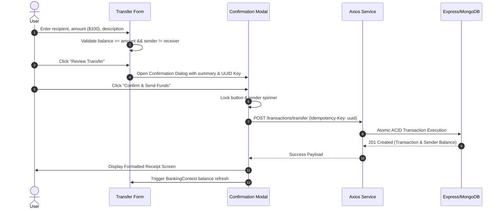

# Implementation Plan: Industry-Standard React Frontend for Banking Backend API

**Branch**: `frontend/react-fintech-app` | **Date**: 2026-09-15 | **Spec**: [`.specify/specs/banking-frontend-react/spec.md`](spec.md)

**Input**: Feature specification from [`.specify/specs/banking-frontend-react/spec.md`](spec.md)

---

## 1. Summary

Architect and construct an enterprise-grade, high-performance client application in **React 18+**, **Vite**, and **Tailwind CSS** connected directly to the existing Node.js/Express/MongoDB banking backend. 

The client implements an executive financial cockpit featuring:
- Live balance aggregation derived via MongoDB aggregation pipelines (`$Credits - $Debits`).
- Two-step confirmation money transfer engine with client-generated UUID v4 `Idempotency-Key` headers and double-click locking.
- Dual session management supporting both HTTP-only cookie credentials (`withCredentials: true`) and Bearer token fallback.
- Server-side session invalidation on logout via MongoDB TTL index (`expires: 0`).
- Multi-account management (Savings & Checking) and sandbox Faucet deposit funding.
- Responsive, accessible design system inspired by top-tier fintech products (Revolut, Mercury, Stripe).

---

## 2. Technical Context

- **Language / Runtime**: JavaScript (ES2022+) / Node.js `>= 18.x`
- **Frontend Framework**: React 18+ (Vite SPA bundler)
- **Styling**: Tailwind CSS v3 with custom fintech color tokens, typography utilities, and glassmorphic surfaces
- **Routing**: React Router DOM v6+ with guarded routes (`ProtectedRoute`, `GuestRoute`)
- **HTTP Client**: Axios with centralized instance (`baseURL: http://localhost:3000/api/v1`), `withCredentials: true`, and global response interceptors
- **Icons**: Lucide React
- **Utility Libraries**: `uuid` (v4 for Idempotency keys), `clsx` / `tailwind-merge` for class composition
- **State Management**:
  - `AuthContext`: Authentication session lifecycle, user profile, login/register/logout actions
  - `BankingContext`: Account cache, active account selector, global balance synchronization
  - `ToastContext`: Stackable, animated notification banners
  - Local state for UI controls, drawers, modals, and controlled form inputs
- **Target Platforms**: Modern evergreen desktop, tablet, and mobile browsers (Chrome, Edge, Safari, Firefox)
- **Performance Goals**:
  - First Contentful Paint (FCP) $< 0.8\text{s}$
  - Zero floating-point discrepancies via integer minor-unit formatting
  - Zero duplicate transfers on rapid user clicks or network replays

---

## 3. Constitution & Safety Gates

1. **Gate 1: Preservation of Existing Backend Architecture**:
   - Backend remains intact at root. No existing backend code is modified or rewritten.
   - Frontend is housed in isolated `client/` workspace.
2. **Gate 2: Idempotency & Financial Precision**:
   - Every state-changing financial transfer MUST generate a unique RFC 4122 UUID v4 and pass it via the `Idempotency-Key` header.
   - Monetary inputs are parsed directly into integer cents (`Math.round(dollars * 100)`) prior to API transmission.
3. **Gate 3: Security & Session Handling**:
   - No JWT secrets or sensitive tokens stored insecurely.
   - Server-side revocation must be respected on logout by dispatching `POST /api/v1/auth/logout`.
4. **Gate 4: Production Realism (No Mocking)**:
   - 100% of data rendered in the application originates from live MongoDB Atlas backend endpoints.

---

## 4. Project Structure

### Documentation (`.specify/specs/banking-frontend-react/`)
```text
.specify/specs/banking-frontend-react/
├── spec.md              # Feature specification (User journeys, FRs, SCs)
├── plan.md              # Architectural blueprint (This document)
└── tasks.md             # Granular implementation checklist (Next step: /speckit-tasks)
```

### Source Code (`client/`)
```text
Banking System/
├── client/                          # React + Vite Frontend Application
│   ├── public/
│   │   ├── favicon.svg
│   │   └── hero-illustration.svg
│   ├── src/
│   │   ├── assets/                  # Brand graphics & background patterns
│   │   ├── components/
│   │   │   ├── common/              # Reusable UI Primitives
│   │   │   │   ├── Button.jsx       # Variants: primary, secondary, danger, ghost; loading spinner
│   │   │   │   ├── Input.jsx        # Prefix/suffix icons, validation error text
│   │   │   │   ├── Select.jsx       # Accessible custom select dropdown
│   │   │   │   ├── Modal.jsx        # Accessible dialog with ESC & backdrop click listeners
│   │   │   │   ├── Badge.jsx        # Status pills (ACTIVE, COMPLETED, PENDING, FAILED)
│   │   │   │   ├── Card.jsx         # Translucent glassmorphism surface
│   │   │   │   ├── Skeleton.jsx     # Shimmer loaders for balances and transaction rows
│   │   │   │   ├── Spinner.jsx      # SVG loading spinner
│   │   │   │   ├── Toast.jsx        # Floating notifications (success, error, warning, info)
│   │   │   │   ├── EmptyState.jsx   # Empty state illustrations with action buttons
│   │   │   │   └── MoneyDisplay.jsx # Formats integer cents into currency ($X.XX)
│   │   │   ├── layout/              # Shell & Layout Wrappers
│   │   │   │   ├── AppLayout.jsx    # Root provider wrapper with Toast container
│   │   │   │   ├── DashboardLayout.jsx # Shell with Sidebar, Header, and content area
│   │   │   │   ├── AuthLayout.jsx   # Split-screen auth layout with marketing hero
│   │   │   │   ├── Sidebar.jsx      # Desktop collapsible navigation
│   │   │   │   ├── MobileNav.jsx    # Slide-over mobile navigation drawer
│   │   │   │   ├── Header.jsx       # Topbar with active account selector & user profile
│   │   │   │   └── Footer.jsx       # Public landing page footer
│   │   │   └── banking/             # Domain Banking Features
│   │   │       ├── BalanceCard.jsx         # Dynamic gradient card with live balance & quick actions
│   │   │       ├── AccountCard.jsx         # Card displaying account type, masked number, status
│   │   │       ├── TransactionRow.jsx      # Row displaying debit/credit icon, party, and amount
│   │   │       ├── TransactionTable.jsx    # Paginated table with status filters
│   │   │       ├── TransferModal.jsx       # 2-step confirmation transfer review modal
│   │   │       ├── FaucetDepositModal.jsx  # Sandbox funding modal with preset chips
│   │   │       ├── CreateAccountModal.jsx  # Modal to provision Checking accounts
│   │   │       ├── TransactionReceipt.jsx  # Detailed receipt view with copyable Tx ID
│   │   │       └── LedgerSummaryCard.jsx   # Credit (inflow) vs Debit (outflow) metrics
│   │   ├── context/                 # Global Application State
│   │   │   ├── AuthContext.jsx      # User session lifecycle & credentials
│   │   │   ├── BankingContext.jsx   # Account list, active account, and balance triggers
│   │   │   └── ToastContext.jsx     # Global toast notification queue
│   │   ├── hooks/                   # Custom Data & Utility Hooks
│   │   │   ├── useAuth.js           # Convenient consumer hook for AuthContext
│   │   │   ├── useBanking.js        # Convenient consumer hook for BankingContext
│   │   │   ├── useToast.js          # Convenient consumer hook for ToastContext
│   │   │   └── useTransactions.js   # Fetches and filters paginated transactions
│   │   ├── pages/                   # Application Page Views
│   │   │   ├── LandingPage.jsx      # Public marketing homepage
│   │   │   ├── LoginPage.jsx        # User login
│   │   │   ├── RegisterPage.jsx     # Customer registration & auto-account provisioning
│   │   │   ├── DashboardPage.jsx    # Executive banking cockpit
│   │   │   ├── AccountsPage.jsx     # Multi-account listing & creation
│   │   │   ├── TransferPage.jsx     # Money transfer workflow
│   │   │   ├── TransactionsPage.jsx # Transaction audit log & search
│   │   │   ├── ProfilePage.jsx      # Profile details & session logout
│   │   │   └── NotFoundPage.jsx     # 404 page
│   │   ├── routes/                  # Route Navigation & Guards
│   │   │   ├── AppRoutes.jsx        # Master router table
│   │   │   ├── ProtectedRoute.jsx   # Enforces active session
│   │   │   └── GuestRoute.jsx       # Redirects logged-in users to /dashboard
│   │   ├── services/                # Backend API Integration Layer
│   │   │   ├── api.js               # Central Axios instance with credentials & interceptors
│   │   │   ├── authService.js       # register, login, getProfile, logout
│   │   │   ├── accountService.js    # getMyAccounts, createAccount, depositFaucet, getBalance
│   │   │   └── transactionService.js# transfer, getHistory, getTransactionById
│   │   ├── utils/                   # Helpers & Formatters
│   │   │   ├── currency.js          # toCents, formatCurrency, parseCents
│   │   │   ├── date.js              # formatDate, formatRelativeTime
│   │   │   └── validators.js        # Email regex, password length, positive integers
│   │   ├── App.jsx                  # Root component
│   │   ├── index.css                # Tailwind directives & design system tokens
│   │   └── main.jsx                 # Entrypoint
│   ├── index.html                   # HTML5 template with modern fonts
│   ├── package.json                 # Client dependencies & scripts
│   ├── postcss.config.js
│   ├── tailwind.config.js           # Extended design tokens & animations
│   └── vite.config.js               # Dev server configuration
├── src/                             # Existing Node.js/Express Backend (Untouched)
├── server.js                        # Existing Backend Server
└── package.json                     # Root package with concurrent dev scripts
```

---

## 5. API Data Contracts & Service Layer

### 1. Centralized HTTP Client (`src/services/api.js`)
```javascript
import axios from "axios";

const api = axios.create({
  baseURL: import.meta.env.VITE_API_URL || "http://localhost:3000/api/v1",
  withCredentials: true, // Sends and receives HTTP-only cookies
  headers: {
    "Content-Type": "application/json"
  }
});

// Response Interceptor: Format errors and handle global 401 Unauthorized
api.interceptors.response.use(
  (response) => response.data,
  (error) => {
    const errorPayload = error.response?.data?.error || {
      code: "NETWORK_ERROR",
      message: error.message || "Unable to communicate with the banking server"
    };

    // If session expired or revoked, broadcast unauthorized event
    if (error.response?.status === 401) {
      window.dispatchEvent(new CustomEvent("banking:unauthorized"));
    }

    return Promise.reject(errorPayload);
  }
);

export default api;
```

### 2. Service Definitions

#### `authService.js`
- `register({ name, email, password })` $\to$ `POST /auth/register`
- `login({ email, password })` $\to$ `POST /auth/login`
- `getProfile()` $\to$ `GET /auth/me`
- `logout()` $\to$ `POST /auth/logout`

#### `accountService.js`
- `getMyAccounts()` $\to$ `GET /accounts/me`
- `createAccount({ accountType, currency })` $\to$ `POST /accounts`
- `depositFaucet(accountId, amountInCents)` $\to$ `POST /accounts/:accountId/deposit`
- `getBalance(accountId)` $\to$ `GET /accounts/:accountId/balance`

#### `transactionService.js`
- `transfer({ senderAccountId, receiverAccountId, amountInCents, description }, idempotencyKey)` $\to$ `POST /transactions/transfer` with header `Idempotency-Key`
- `getHistory({ page = 1, limit = 10 })` $\to$ `GET /transactions/history`
- `getTransactionById(id)` $\to$ `GET /transactions/:id`

---

## 6. Design System Specifications

### Color Tokens
- `slate-950`: `#090D16` (Deep Obsidian Base Background)
- `slate-900`: `#0F172A` (Card and Elevated Surface)
- `emerald-500`: `#10B981` (Financial Mint Emerald - Inflow / Active / Success)
- `indigo-600`: `#4F46E5` (Primary CTA & Brand Signature)
- `rose-500`: `#F43F5E` (Debit / Outflow / Danger)
- `amber-500`: `#F59E0B` (Pending / In-Flight Status)

### Financial Typography
- Primary Font: `Inter` / System Sans-Serif Stack with `-webkit-font-smoothing: antialiased`
- Numeric Display: Tabular font figures (`tabular-nums font-semibold tracking-tight`)
- Hierarchy:
  - Hero Balance: `text-4xl lg:text-5xl font-extrabold text-white tracking-tight`
  - Stat Values: `text-2xl font-bold text-white`
  - Table Cell Amounts: `text-sm font-semibold tabular-nums`

### Components & Micro-Interactions
- **Glassmorphism**: `bg-slate-900/70 backdrop-blur-md border border-white/10 shadow-2xl`
- **Buttons**: Micro-scale click feedback (`active:scale-[0.98] transition duration-150`)
- **Shimmer Skeletons**: CSS gradient animation (`linear-gradient(90deg, ...)` with infinite pulse)

---

## 7. Two-Step Transfer Confirmation Architecture



---

## 8. Verification & Delivery Standards

1. **Automated Build Validation**: `npm run build` inside `client/` compiles with zero errors or warnings.
2. **Full-Stack Live Testing**:
   - Register a user on the frontend $\to$ check document creation in MongoDB Atlas.
   - Deposit $500.00 via Faucet $\to$ confirm live `$500.00` balance display.
   - Open second account $\to$ transfer $100.00 \to$ confirm `$400.00` in Savings and `$100.00` in Checking.
   - Verify transaction history log and receipt drill-down.
   - Logout $\to$ confirm immediate rejection of protected routes and blacklisting in MongoDB.
3. **Accessibility**: All dialogs trap focus, inputs have labels, and color contrast complies with WCAG AA.
