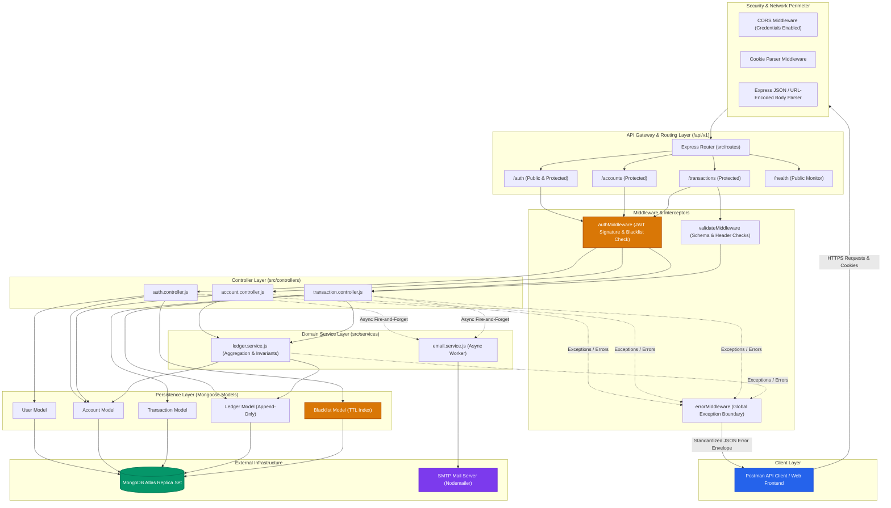
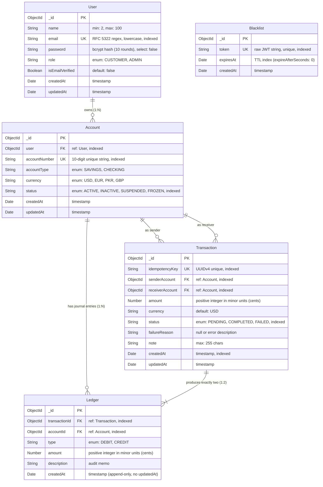
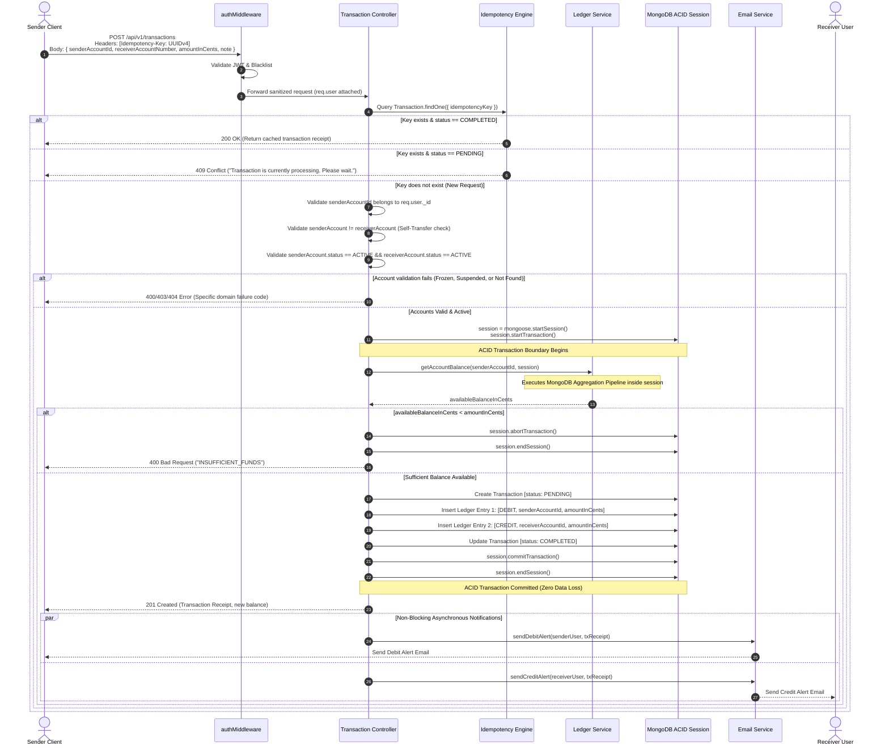
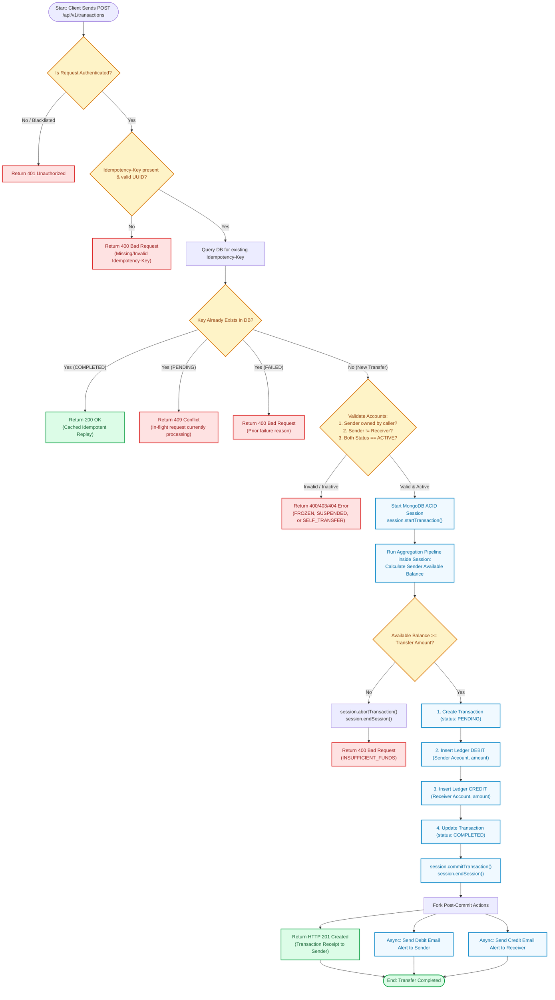
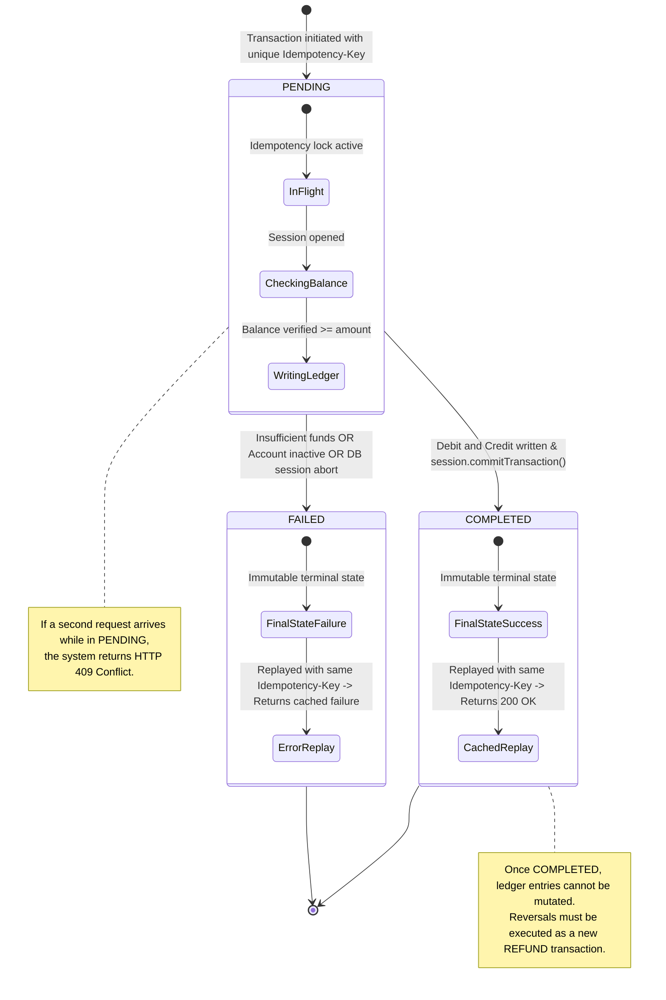
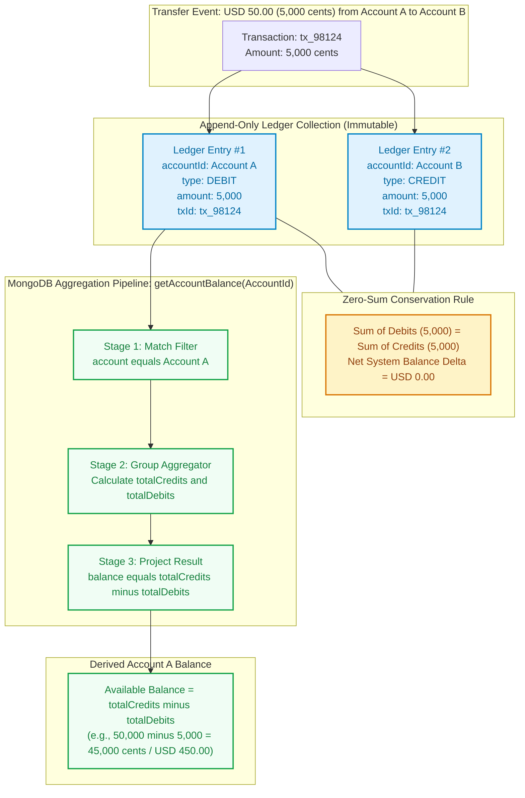
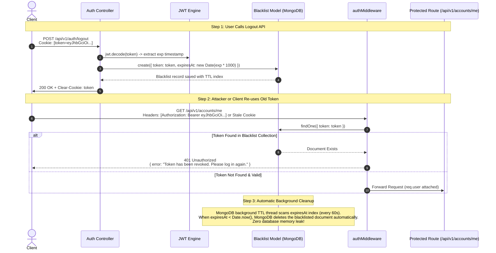

# Banking Backend API — 10 System Architecture & Design Diagrams

**Document Version**: 2.0.0  
**Date**: 2026-09-14  
**Source of Truth**: [`.specify/specs/banking-backend-api/spec.md`](file:///c:/Users/hamih/OneDrive/Desktop/AtoZ%20Coder/Advanced%20MERN/Banking%20System/.specify/specs/banking-backend-api/spec.md)  
**Status**: Formal Architectural Baseline

---

## 📋 Complete Diagram Coverage Matrix

| # | Diagram | Kyun chahiye? (Purpose) | File Link |
|---|---|---|---|
| **1** | **System / Application Flow Diagram** | **Poore project ka high-level user flow** samajhne ke liye | [`docs/diagrams/01-system-application-flow.mmd`](file:///c:/Users/hamih/OneDrive/Desktop/AtoZ%20Coder/Advanced%20MERN/Banking%20System/docs/diagrams/01-system-application-flow.mmd) |
| **2** | **System Architecture Diagram** | Backend ke components ka structure aur layer separation | [`docs/diagrams/02-system-architecture.mmd`](file:///c:/Users/hamih/OneDrive/Desktop/AtoZ%20Coder/Advanced%20MERN/Banking%20System/docs/diagrams/02-system-architecture.mmd) |
| **3** | **Database ER Diagram** | Models, collections aur foreign relationships | [`docs/diagrams/03-database-er.mmd`](file:///c:/Users/hamih/OneDrive/Desktop/AtoZ%20Coder/Advanced%20MERN/Banking%20System/docs/diagrams/03-database-er.mmd) |
| **4** | **Authentication Sequence Diagram** | Register, Login, Bcrypt, JWT, aur Cookie ka actual execution | [`docs/diagrams/04-authentication-sequence.mmd`](file:///c:/Users/hamih/OneDrive/Desktop/AtoZ%20Coder/Advanced%20MERN/Banking%20System/docs/diagrams/04-authentication-sequence.mmd) |
| **5** | **Transaction Sequence Diagram** | Transaction ke code execution, ACID session aur ledger writes ka flow | [`docs/diagrams/05-transaction-sequence.mmd`](file:///c:/Users/hamih/OneDrive/Desktop/AtoZ%20Coder/Advanced%20MERN/Banking%20System/docs/diagrams/05-transaction-sequence.mmd) |
| **6** | **Transaction Activity Diagram** | Transaction ke decisions, validations, error branches aur forks | [`docs/diagrams/06-transaction-activity.mmd`](file:///c:/Users/hamih/OneDrive/Desktop/AtoZ%20Coder/Advanced%20MERN/Banking%20System/docs/diagrams/06-transaction-activity.mmd) |
| **7** | **Transaction State Diagram** | Pending → Completed / Failed lifecycle state machine | [`docs/diagrams/07-transaction-state.mmd`](file:///c:/Users/hamih/OneDrive/Desktop/AtoZ%20Coder/Advanced%20MERN/Banking%20System/docs/diagrams/07-transaction-state.mmd) |
| **8** | **Ledger & Balance Flow Diagram** | Ledger entries → Aggregation Pipeline → Derived Balance math | [`docs/diagrams/08-ledger-balance-flow.mmd`](file:///c:/Users/hamih/OneDrive/Desktop/AtoZ%20Coder/Advanced%20MERN/Banking%20System/docs/diagrams/08-ledger-balance-flow.mmd) |
| **9** | **Logout / Blacklist Flow Diagram** | JWT revocation, MongoDB TTL index cleanup aur auth interception | [`docs/diagrams/09-logout-blacklist-flow.mmd`](file:///c:/Users/hamih/OneDrive/Desktop/AtoZ%20Coder/Advanced%20MERN/Banking%20System/docs/diagrams/09-logout-blacklist-flow.mmd) |
| **10** | **Deployment Topology Diagram** | Nginx, Node.js PM2, Atlas 3-node Replica Set, DNS fallback aur SMTP | [`docs/diagrams/10-deployment-topology.mmd`](file:///c:/Users/hamih/OneDrive/Desktop/AtoZ%20Coder/Advanced%20MERN/Banking%20System/docs/diagrams/10-deployment-topology.mmd) |

> [!TIP]
> **Interactive Viewer**: Open [`docs/diagrams/index.html`](file:///c:/Users/hamih/OneDrive/Desktop/AtoZ%20Coder/Advanced%20MERN/Banking%20System/docs/diagrams/index.html) in your browser to view all 10 diagrams rendered live with interactive tabs and zoom.

---

## 1. System / Application Flow Diagram

### Purpose:
Poore banking backend ka user lifecycle flow samajhne ke liye: Registration se account provision, initial deposit, transfer, balance derivation, transaction history, aur logout tak.

```mermaid
flowchart TD
    Start([User Starts / App Opened]) --> Register[1. Register User<br/>POST /api/v1/auth/register]
    Register --> AutoAcct[Auto-provision 10-digit Savings Account<br/>Account status: ACTIVE]
    AutoAcct --> WelcomeMail[Async: Send Welcome Email via Nodemailer]
    AutoAcct --> Login[2. Login<br/>POST /api/v1/auth/login]
    
    Login --> IssueCookie[Verify bcrypt hash & Issue HTTP-Only JWT Cookie]
    IssueCookie --> AuthState[Authenticated Session Active]

    AuthState --> Faucet[3. Initial Deposit / Faucet<br/>POST /api/v1/accounts/:id/deposit]
    Faucet --> WriteDepositLedger[Record CREDIT in Ledger<br/>Money enters system]
    WriteDepositLedger --> CheckBal1[4. Check Initial Balance<br/>GET /api/v1/accounts/:id/balance]
    CheckBal1 --> DeriveBal1[Aggregate Ledger: Credits - Debits]

    DeriveBal1 --> Transfer[5. Transfer Money<br/>POST /api/v1/transactions<br/>Header: Idempotency-Key]
    
    Transfer --> TxPipeline[Execute ACID Transaction in Mongo Session:<br/>- Check Idempotency<br/>- Verify Account Statuses<br/>- Aggregate Sender Balance<br/>- Create PENDING Transaction<br/>- Write DEBIT & CREDIT in Ledger<br/>- Update COMPLETED<br/>- Commit Session]

    TxPipeline --> TxAlerts[Async: Send Debit Alert to Sender<br/>& Credit Alert to Receiver]
    TxAlerts --> CheckBal2[6. Check Updated Balances<br/>Sender balance reduced, Receiver balance increased]

    CheckBal2 --> History[7. View Transaction History<br/>GET /api/v1/transactions/history]
    
    History --> Logout[8. Logout<br/>POST /api/v1/auth/logout]
    Logout --> BlacklistSave[Store JWT in Blacklist with Mongo TTL Index]
    BlacklistSave --> ClearCookie[Clear HTTP-Only Cookie]
    ClearCookie --> EndState([Logged Out - Old Token Revoked])

    classDef primary fill:#2563eb,stroke:#1d4ed8,stroke-width:2px,color:#fff;
    classDef action fill:#059669,stroke:#047857,stroke-width:2px,color:#fff;
    classDef security fill:#d97706,stroke:#b45309,stroke-width:2px,color:#fff;
    classDef finish fill:#64748b,stroke:#475569,stroke-width:2px,color:#fff;

    class Start,AuthState primary;
    class Register,AutoAcct,Login,Faucet,Transfer,History action;
    class IssueCookie,TxPipeline,BlacklistSave security;
    class EndState finish;
```



---

## 2. System Architecture Diagram

### Purpose:
Backend ke layered components ka structural separation: Client $\rightarrow$ Security Perimeter $\rightarrow$ Router $\rightarrow$ Middlewares $\rightarrow$ Controllers $\rightarrow$ Services $\rightarrow$ Mongoose Models $\rightarrow$ Database & Mail Server.



---

## 3. Database ER Diagram

### Purpose:
Database schemas, data types, indexes, unique constraints, and relationships. Highlights that `Account` contains **no mutable balance field**.



---

## 4. Authentication Sequence Diagram

### Purpose:
Register/Login/JWT/Cookie ka actual flow: Bcrypt password hashing, constant-time comparison, JWT generation, HTTP-only cookie setting, aur non-blocking welcome email.

```mermaid
sequenceDiagram
    autonumber
    actor Client
    participant AuthCtrl as Auth Controller
    participant UserMod as User Model
    participant AcctMod as Account Model
    participant JWT as JWT Engine
    participant Cookie as Cookie Dispatcher
    participant EmailSvc as Email Service

    Note over Client,EmailSvc: Part 1: User Registration
    Client->>AuthCtrl: POST /api/v1/auth/register { name, email, password }
    AuthCtrl->>UserMod: Check if email exists
    alt Email already in use
        UserMod-->>AuthCtrl: Duplicate found
        AuthCtrl-->>Client: 409 Conflict ("Email already registered")
    else Email available
        AuthCtrl->>UserMod: Save new User
        Note over UserMod: pre('save') hashes password using bcrypt (10 rounds)
        UserMod->>UserMod: Document saved
        AuthCtrl->>AcctMod: Auto-generate 10-digit number & create Savings Account
        AcctMod->>AcctMod: Account saved (status: ACTIVE)
        AuthCtrl->>EmailSvc: sendWelcomeEmail(user, account) [Async Non-blocking]
        AuthCtrl-->>Client: 201 Created { user, account, message }
    end

    Note over Client,EmailSvc: Part 2: User Login
    Client->>AuthCtrl: POST /api/v1/auth/login { email, password }
    AuthCtrl->>UserMod: findOne({ email }).select('+password')
    alt User not found
        AuthCtrl-->>Client: 401 Unauthorized ("Invalid email or password")
    else User exists
        AuthCtrl->>UserMod: user.comparePassword(password)
        alt Password Mismatch
            AuthCtrl-->>Client: 401 Unauthorized ("Invalid email or password")
        else Password Matches
            AuthCtrl->>JWT: sign({ userId: user._id, role: user.role }, JWT_SECRET, { expiresIn: '24h' })
            JWT-->>AuthCtrl: Signed Token String
            AuthCtrl->>Cookie: Set-Cookie: token=token; HttpOnly; SameSite=Strict; Secure
            AuthCtrl-->>Client: 200 OK { token, user, message }
        end
    end
```

---

## 5. Transaction Sequence Diagram

### Purpose:
Transaction ke code execution ka flow: Client request se le kar MongoDB ACID session, aggregation check, double-entry writes, commit, aur async email alerts tak.



---

## 6. Transaction Activity Diagram

### Purpose:
Transaction ke decisions, validations, error branches, forks, aur rollbacks samajhne ke liye complete activity flowchart.



---

## 7. Transaction State Diagram

### Purpose:
Transaction entity ka finite state machine: `PENDING` $\rightarrow$ `COMPLETED` / `FAILED`, in-flight locks, and immutable terminal states.



---

## 8. Ledger & Balance Flow Diagram

### Purpose:
Ledger $\rightarrow$ Aggregation $\rightarrow$ Balance samajhne ke liye: Double-entry bookkeeping rules ($Debit = Credit$) aur MongoDB 3-stage Aggregation Pipeline ($Credits - Debits$).



---

## 9. Logout / Blacklist Flow Diagram

### Purpose:
JWT blacklist aur logout ka flow: Token expiry extraction, MongoDB TTL index par save, cookie clearing, aur subsequent requests ka immediate 401 rejection.



---

## 10. Deployment Topology Diagram

### Purpose:
Production environment topology: Nginx reverse proxy, Node.js process cluster, public DNS resolvers (8.8.8.8), MongoDB Atlas 3-node Replica Set, aur SMTP server.

```mermaid
graph LR
    subgraph Client_Network ["External Internet"]
        WebClients["Browser / Mobile Apps"]
        PostmanClient["Postman Automated Test Suite"]
    end

    subgraph Host_Server ["Production Server Environment (Node.js v20+)"]
        direction TB
        Nginx["Reverse Proxy / TLS Termination (Port 443 HTTPS)"]
        
        subgraph Process_Cluster ["Application Process Layer"]
            AppInstance["Express.js Server (Port 3000)<br/>PM2 / Docker Managed"]
            DNSConfig["Node.js DNS Resolver<br/>dns.setServers(['8.8.8.8', '8.8.4.4'])"]
            EnvConfig["dotenv (.env)<br/>PORT, MONGO_URI, JWT_SECRET, SMTP_*"]
        end
    end

    subgraph MongoDB_Cloud ["MongoDB Atlas Cloud (AWS / GCP)"]
        direction TB
        PrimaryNode[("Primary Node (Read/Write)")]
        Secondary1[("Secondary Replica 1")]
        Secondary2[("Secondary Replica 2")]
        
        PrimaryNode <-->|Replication Oplog| Secondary1
        PrimaryNode <-->|Replication Oplog| Secondary2
    end

    subgraph SMTP_Cloud ["Email Service Provider"]
        MailServer["SMTP Gateway (TLS Port 587/465)<br/>Gmail / SendGrid / Mailtrap"]
    end

    WebClients & PostmanClient -->|HTTPS + Encrypted Cookies| Nginx
    Nginx -->|Reverse Proxy HTTP:3000| AppInstance
    
    AppInstance -.-> DNSConfig
    AppInstance -.-> EnvConfig
    
    DNSConfig -->|Resolves SRV Records| AppInstance
    AppInstance -->|TLS MongoDB Wire Protocol (Port 27017)| PrimaryNode
    AppInstance -->|SMTP Protocols| MailServer

    classDef server fill:#f8fafc,stroke:#475569,stroke-width:2px;
    classDef db fill:#ecfdf5,stroke:#059669,stroke-width:2px;
    classDef mail fill:#faf5ff,stroke:#7c3aed,stroke-width:2px;

    class Host_Server server;
    class MongoDB_Cloud db;
    class SMTP_Cloud mail;
```
