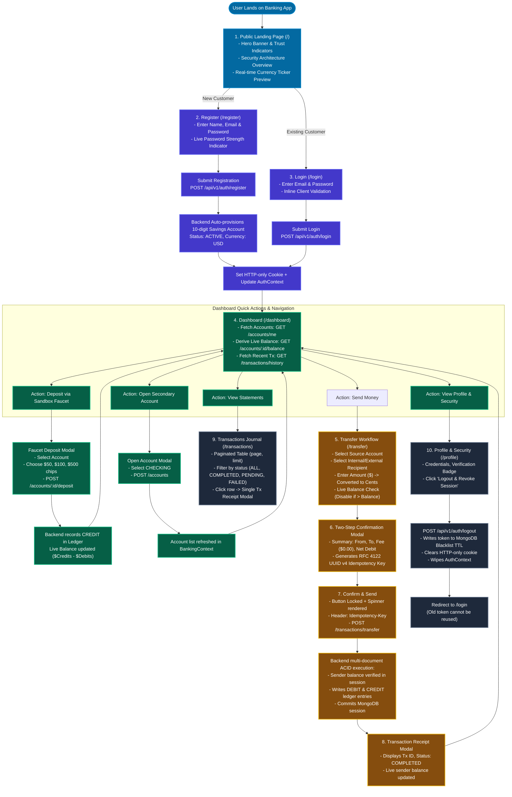
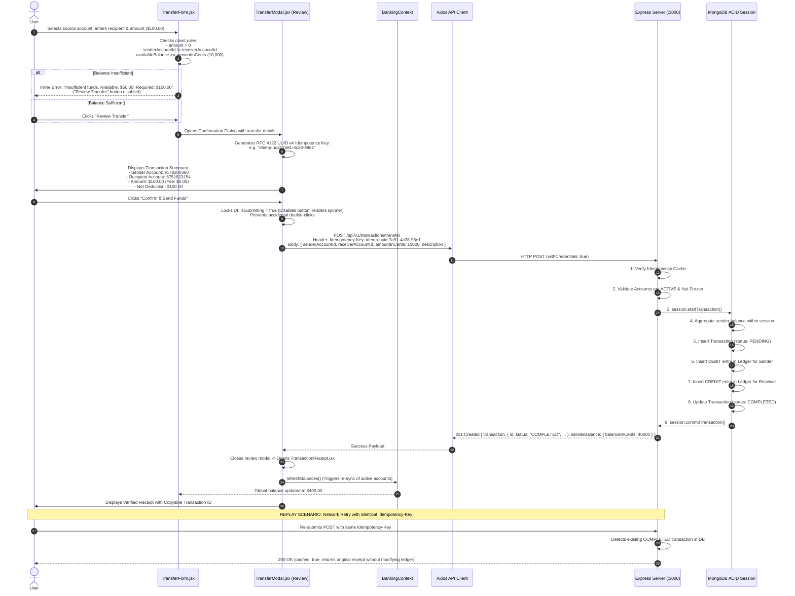
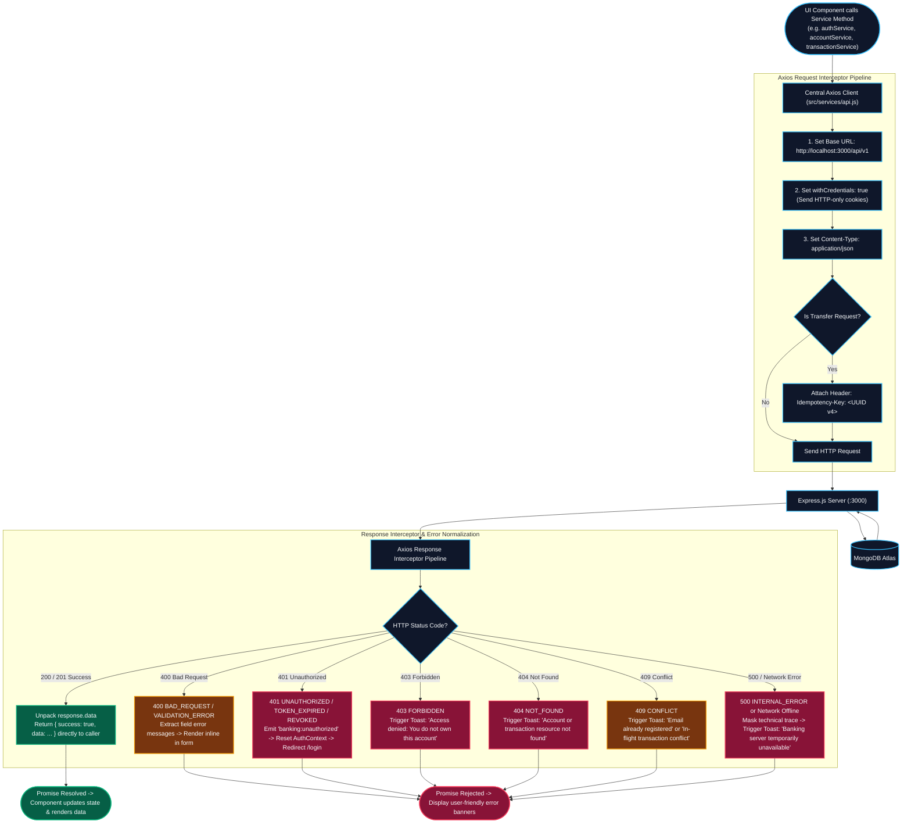
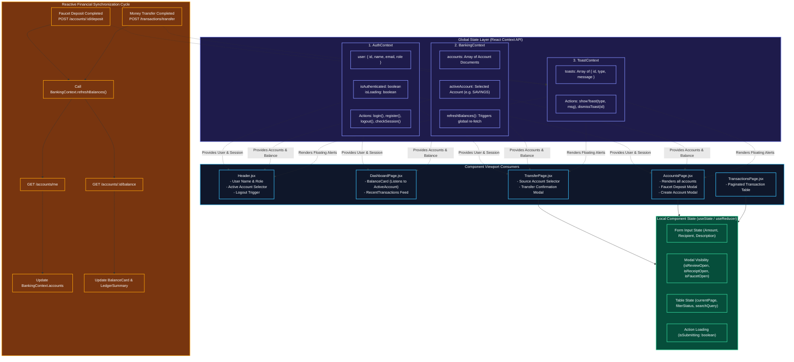
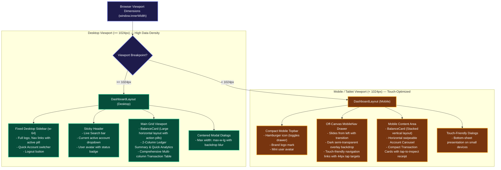

# Banking Frontend React — 8 Architectural & Design Diagrams

**Document Version**: 1.0.0  
**Date**: 2026-09-15  
**Source of Truth**: [`.specify/specs/banking-frontend-react/spec.md`](../.specify/specs/banking-frontend-react/spec.md) & [`.specify/specs/banking-frontend-react/plan.md`](../.specify/specs/banking-frontend-react/plan.md)  
**Status**: Formal Frontend Architectural Baseline

---

## 📋 Complete Diagram Coverage Matrix

| # | Diagram | Kyun zaroori hai? (Purpose & Value) | Diagram File |
|---|---|---|---|
| **1** | **Frontend Architecture Diagram** | Pure client app ka high-level structure, routing, context, Axios, aur backend integration samajhne ke liye | [`docs/diagrams/frontend/01-frontend-architecture.mmd`](diagrams/frontend/01-frontend-architecture.mmd) |
| **2** | **Application / User Flow Diagram** | Landing se Registration, Login, Faucet deposit, 2-step transfer, statement filtering, aur logout ka end-to-end user journey | [`docs/diagrams/frontend/02-frontend-application-flow.mmd`](diagrams/frontend/02-frontend-application-flow.mmd) |
| **3** | **Component Architecture Diagram** | Reusable components ka tree: Layouts, Guards, Domain components (BalanceCard, TransferModal, TransactionTable), aur UI Primitives | [`docs/diagrams/frontend/03-frontend-component-architecture.mmd`](diagrams/frontend/03-frontend-component-architecture.mmd) |
| **4** | **Authentication & Session Flow** | Registration, Login, HTTP-only cookies, page reload par `/auth/me` se session hydration, aur logout par token blacklisting | [`docs/diagrams/frontend/04-frontend-authentication-flow.mmd`](diagrams/frontend/04-frontend-authentication-flow.mmd) |
| **5** | **Transaction & Idempotency Flow** | Transfer form validation, 2-step review modal, UUID v4 Idempotency Key, double-click locking, aur instant receipt rendering | [`docs/diagrams/frontend/05-frontend-transaction-flow.mmd`](diagrams/frontend/05-frontend-transaction-flow.mmd) |
| **6** | **API Integration & Error Flow** | Axios client ka pipeline: credentials, headers, 200 data unwrapping, 400 inline errors, 401 logout redirect, aur 500 error masking | [`docs/diagrams/frontend/06-frontend-api-integration-flow.mmd`](diagrams/frontend/06-frontend-api-integration-flow.mmd) |
| **7** | **State Management Flow** | Global Contexts (`AuthContext`, `BankingContext`, `ToastContext`) aur local state ke darmiyan reactive balance synchronization | [`docs/diagrams/frontend/07-frontend-state-management-flow.mmd`](diagrams/frontend/07-frontend-state-management-flow.mmd) |
| **8** | **Responsive Layout Flow** | Desktop ($\ge 1024px$) vs Mobile ($< 1024px$) layout differences: Fixed sidebar vs slide-over drawer, tables vs mobile cards | [`docs/diagrams/frontend/08-frontend-responsive-layout-flow.mmd`](diagrams/frontend/08-frontend-responsive-layout-flow.mmd) |

> [!TIP]
> **Live Interactive Viewer**: Open [`docs/diagrams/frontend/index.html`](diagrams/frontend/index.html) in your web browser to view all 8 diagrams rendered live with tabbed switching, zoom, and dark theme styling.

---

## 1. Frontend Architecture Diagram

### Purpose & Explanation (Kyun zaroori hai?):
Yeh diagram pure React + Vite frontend ka high-level bird's-eye view deta hai: Viewport layer se le kar Routing, Layout wrappers, Pages, Global Contexts, Centralized Axios Client, Transport Security Boundary, aur MongoDB Atlas backend tak.

```mermaid
flowchart TB
    subgraph Client["Client Browser (React 18 SPA + Vite)"]
        subgraph Viewport["Responsive Viewport Layer"]
            Desktop["Desktop View (>= 1024px)"]
            Mobile["Mobile / Tablet (< 1024px)"]
        end

        subgraph Routing["Routing & Security Guards (React Router v6)"]
            Router["AppRoutes"]
            PublicRoute["Public Routes (Landing /)"]
            GuestRoute["GuestGuard (/login, /register)"]
            AuthRoute["AuthGuard (/dashboard, /accounts, /transfer, /tx)"]
        end

        subgraph Layouts["Layout Architecture"]
            AppShell["AppLayout (Root + ToastContainer)"]
            AuthLayout["AuthLayout (Split Branded Panel)"]
            DashLayout["DashboardLayout (Sidebar + Header + Main)"]
        end

        subgraph Pages["Application Pages"]
            Landing["LandingPage"]
            Login["LoginPage"]
            Register["RegisterPage"]
            Dashboard["DashboardPage"]
            Accounts["AccountsPage"]
            Transfer["TransferPage"]
            Transactions["TransactionsPage"]
            Profile["ProfilePage"]
        end

        subgraph StateLayer["State Management Architecture"]
            AuthCtx["AuthContext (User, Session, Logout)"]
            BankCtx["BankingContext (Accounts, Active Account, Sync)"]
            ToastCtx["ToastContext (Global Notifications)"]
            LocalState["Component State (Forms, Modals, Filters)"]
        end

        subgraph Primitives["Reusable Design System Primitives"]
            Buttons["Button (Variants + Loading)"]
            Inputs["Input & Select (Validation)"]
            Modals["Modal (Focus Trap + Backdrop)"]
            Cards["Card (Glassmorphic Surface)"]
            Badges["Badge (Status Colors)"]
            Money["MoneyDisplay (Cents Formatter)"]
            Skeletons["Skeleton (Shimmer Loaders)"]
        end

        subgraph APILayer["API Integration Layer"]
            AxiosClient["Central Axios Client (withCredentials: true)"]
            AuthService["authService"]
            AccountService["accountService"]
            TxService["transactionService"]
            InterceptorReq["Request Interceptor (Idempotency-Key)"]
            InterceptorRes["Response Interceptor (ApiError & 401 Handler)"]
        end
    end

    subgraph SecurityBoundary["Transport & Security Protocols"]
        CookieSec["HTTP-Only Cookie (token)"]
        IdempHeader["Header: Idempotency-Key (UUID v4)"]
        CORSSec["CORS with Credentials (Origin Mirrored)"]
    end

    subgraph BackendSystem["Banking Backend Infrastructure (:3000)"]
        ExpressApp["Express.js Server (src/app.js)"]
        AuthMiddleware["authMiddleware (Cookie/Bearer + Blacklist)"]
        FeatureControllers["Auth, Account & Tx Controllers"]
        MongoAtlas[("MongoDB Atlas Replica Set\n- Users, Accounts\n- Append-Only Ledger\n- Transactions (ACID)\n- Blacklist (TTL Index)")]
    end

    Viewport --> Routing
    Routing --> Layouts
    Layouts --> Pages
    Pages --> Primitives
    Pages --> StateLayer
    StateLayer --> APILayer
    APILayer --> AxiosClient
    AxiosClient --> InterceptorReq
    AxiosClient --> InterceptorRes
    InterceptorReq --> SecurityBoundary
    SecurityBoundary --> BackendSystem
    BackendSystem --> MongoAtlas

    classDef client fill:#0f172a,stroke:#38bdf8,stroke-width:2px,color:#f8fafc;
    classDef state fill:#1e1b4b,stroke:#818cf8,stroke-width:2px,color:#f8fafc;
    classDef api fill:#064e3b,stroke:#34d399,stroke-width:2px,color:#f8fafc;
    classDef security fill:#78350f,stroke:#f59e0b,stroke-width:2px,color:#f8fafc;
    classDef backend fill:#1e293b,stroke:#94a3b8,stroke-width:2px,color:#f8fafc;

    class Client,Pages,Primitives,Layouts client;
    class StateLayer,AuthCtx,BankCtx,ToastCtx state;
    class APILayer,AxiosClient,AuthService,AccountService,TxService api;
    class SecurityBoundary,CookieSec,IdempHeader,CORSSec security;
    class BackendSystem,ExpressApp,AuthMiddleware,FeatureControllers,MongoAtlas backend;
```



---

## 2. Application / User Flow Diagram

### Purpose & Explanation (Kyun zaroori hai?):
Yeh diagram customer ka complete end-to-end journey dikhata hai: Landing page dekhne se account open karna, Faucet se paise deposit karna, real-time balance check karna, 2-step confirmation ke sath paisay transfer karna, statements dekhna, aur logout tak.



---

## 3. Component Architecture Diagram

### Purpose & Explanation (Kyun zaroori hai?):
Yeh diagram React component hierarchy aur separation of concerns ko visual karta hai: Root providers, Route guards, Shell layouts, Domain-specific banking widgets, aur common atomic design system primitives.

```mermaid
flowchart TD
    App["App.jsx (Root Entry)"] --> ToastProv["ToastProvider (ToastContext)"]
    ToastProv --> AuthProv["AuthProvider (AuthContext)"]
    AuthProv --> BankProv["BankingProvider (BankingContext)"]
    BankProv --> AppRoutes["AppRoutes.jsx (React Router)"]

    AppRoutes --> PublicViews["Public Route Layer"]
    AppRoutes --> GuestViews["Guest-Only Guard Layer"]
    AppRoutes --> ProtectedViews["Protected Guard Layer"]

    subgraph PublicViewsGroup["Public Views"]
        PublicViews --> LandingPage["LandingPage.jsx"]
        LandingPage --> HeroSec["HeroSection.jsx"]
        LandingPage --> FeatureGrid["FeatureGrid.jsx"]
        LandingPage --> SecurityStats["SecurityStats.jsx"]
        LandingPage --> CurrencyTicker["CurrencyTicker.jsx"]
        LandingPage --> Footer["Footer.jsx"]
    end

    subgraph GuestViewsGroup["Guest Views (Unauthenticated)"]
        GuestViews --> AuthLayout["AuthLayout.jsx (Branded Split Screen)"]
        AuthLayout --> LoginPage["LoginPage.jsx"]
        AuthLayout --> RegisterPage["RegisterPage.jsx"]
        LoginPage --> PasswordInput["Input.jsx (with Show/Hide)"]
        RegisterPage --> PasswordStrength["PasswordStrengthMeter.jsx"]
    end

    subgraph ProtectedViewsGroup["Protected Views (Authenticated Shell)"]
        ProtectedViews --> DashboardLayout["DashboardLayout.jsx"]
        
        DashboardLayout --> Sidebar["Sidebar.jsx (Desktop Navigation)"]
        DashboardLayout --> MobileNav["MobileNav.jsx (Slide-over Drawer)"]
        DashboardLayout --> Header["Header.jsx (Active Account, Avatar, Logout)"]
        DashboardLayout --> PageContent["Page Content Viewport"]

        PageContent --> DashboardPage["DashboardPage.jsx"]
        PageContent --> AccountsPage["AccountsPage.jsx"]
        PageContent --> TransferPage["TransferPage.jsx"]
        PageContent --> TransactionsPage["TransactionsPage.jsx"]
        PageContent --> ProfilePage["ProfilePage.jsx"]
    end

    subgraph DashboardComponents["Dashboard Domain Components"]
        DashboardPage --> BalanceCard["BalanceCard.jsx (Gradient + Quick Actions)"]
        DashboardPage --> LedgerSummary["LedgerSummaryCard.jsx (Inflow vs Outflow)"]
        DashboardPage --> AccountCarousel["AccountCarousel.jsx (Savings / Checking)"]
        DashboardPage --> RecentTxFeed["RecentTransactions.jsx (Activity Feed)"]
    end

    subgraph AccountsComponents["Accounts Domain Components"]
        AccountsPage --> AccountCard["AccountCard.jsx (10-Digit Copy + Status)"]
        AccountsPage --> CreateAccountModal["CreateAccountModal.jsx (Open Checking)"]
        AccountsPage --> FaucetDepositModal["FaucetDepositModal.jsx (Deposit Presets)"]
    end

    subgraph TransferComponents["Transfer Domain Components"]
        TransferPage --> TransferForm["TransferForm.jsx (Balance Validation)"]
        TransferPage --> TransferModal["TransferModal.jsx (Two-Step Review)"]
        TransferPage --> TransactionReceipt["TransactionReceipt.jsx (Print/Copy Receipt)"]
    end

    subgraph TransactionsComponents["Transactions Domain Components"]
        TransactionsPage --> TransactionFilters["TransactionFilters.jsx (Status Tabs + Search)"]
        TransactionsPage --> TransactionTable["TransactionTable.jsx (Sortable Columns)"]
        TransactionTable --> TransactionRow["TransactionRow.jsx (Credit/Debit Badges)"]
        TransactionsPage --> Pagination["Pagination.jsx (Page Jump & Limit)"]
    end

    subgraph CommonPrimitives["Shared UI Primitives (Design System)"]
        Button["Button.jsx"]
        Input["Input.jsx"]
        Select["Select.jsx"]
        Modal["Modal.jsx"]
        Card["Card.jsx"]
        Badge["Badge.jsx"]
        Skeleton["Skeleton.jsx"]
        MoneyDisplay["MoneyDisplay.jsx"]
        Toast["Toast.jsx"]
        EmptyState["EmptyState.jsx"]
    end

    classDef root fill:#0f172a,stroke:#38bdf8,stroke-width:2px,color:#f8fafc;
    classDef layout fill:#1e1b4b,stroke:#818cf8,stroke-width:2px,color:#f8fafc;
    classDef pages fill:#064e3b,stroke:#34d399,stroke-width:2px,color:#f8fafc;
    classDef components fill:#78350f,stroke:#f59e0b,stroke-width:2px,color:#f8fafc;
    classDef primitives fill:#1e293b,stroke:#94a3b8,stroke-width:2px,color:#f8fafc;

    class App,ToastProv,AuthProv,BankProv,AppRoutes root;
    class PublicViews,GuestViews,ProtectedViews,AuthLayout,DashboardLayout,Sidebar,MobileNav,Header layout;
    class LandingPage,LoginPage,RegisterPage,DashboardPage,AccountsPage,TransferPage,TransactionsPage,ProfilePage pages;
    class BalanceCard,LedgerSummary,AccountCard,TransferModal,TransactionTable,CreateAccountModal,FaucetDepositModal components;
    class Button,Input,Select,Modal,Card,Badge,Skeleton,MoneyDisplay,Toast,EmptyState primitives;
```



---

## 4. Authentication & Session Lifecycle Sequence

### Purpose & Explanation (Kyun zaroori hai?):
Authentication ke chaar critical scenarios ko step-by-step explain karta hai:
1. Naye customer ki registration aur auto-account provisioning.
2. Hard browser refresh (F5) par HTTP-only cookie ke zariye `/auth/me` se session restore karna.
3. Logout par MongoDB Blacklist collection me TTL index ke zariye token revoke karna aur cookie clear karna.
4. Revoked token ko dobara chalane ki koshish par server-side 401 rejection aur login par redirect.

```mermaid
sequenceDiagram
    autonumber
    actor User
    participant UI as React UI (Login/Register)
    participant AuthCtx as AuthContext
    participant Axios as Axios API Client
    participant Server as Express Server (:3000)
    participant DB as MongoDB Atlas

    Note over User,DB: SCENARIO 1: Registration & Instant Account Provisioning
    User->>UI: Fills name, email, password & submits
    UI->>Axios: POST /api/v1/auth/register
    Axios->>Server: HTTP POST (withCredentials: true)
    Server->>DB: Hash password (bcrypt 10 rounds) & create User
    Server->>DB: Auto-provision 10-digit Savings Account
    Server-->>Axios: 201 Created + Set-Cookie: token=<jwt>; HttpOnly; SameSite=Strict
    Axios-->>AuthCtx: { user, account, token }
    AuthCtx-->>UI: Sets isAuthenticated: true, user: user
    UI->>User: Redirects to /dashboard (Welcome toast displayed)

    Note over User,DB: SCENARIO 2: Page Refresh & Session Hydration
    User->>UI: Hard Refresh Browser (F5)
    UI->>AuthCtx: Mounts -> Checks initial state (isLoading: true)
    AuthCtx->>Axios: GET /api/v1/auth/me
    Axios->>Server: HTTP GET with Cookie: token=<jwt>
    Server->>DB: Check token against Blacklist collection
    alt Token is Revoked
        Server-->>Axios: 401 Unauthorized ("Token has been revoked")
        Axios-->>AuthCtx: Error: Session Expired
        AuthCtx-->>UI: Reset user state -> Redirect to /login
    else Token is Valid
        Server->>DB: Find user by decoded token ID
        Server-->>Axios: 200 OK { user: userProfile }
        Axios-->>AuthCtx: Sets user state (isLoading: false, isAuthenticated: true)
        AuthCtx-->>UI: Restores protected Dashboard view
    end

    Note over User,DB: SCENARIO 3: Secure Logout & Blacklist TTL Revocation
    User->>UI: Clicks "Logout & Revoke Session"
    UI->>AuthCtx: logout()
    AuthCtx->>Axios: POST /api/v1/auth/logout
    Axios->>Server: HTTP POST with Cookie: token=<jwt>
    Server->>DB: Insert token into Blacklist collection (expiresAt: decoded.exp)
    Server-->>Axios: Set-Cookie: token=none; Max-Age=0 + 200 OK
    Axios-->>AuthCtx: Success
    AuthCtx-->>UI: Wipes user & session state
    UI->>User: Redirects to /login (Toast: "Logged out successfully")

    Note over User,DB: SCENARIO 4: Revoked Token Replay Protection
    User->>UI: Attempt accessing /api/v1/auth/me with old revoked token
    UI->>Axios: GET /api/v1/auth/me
    Axios->>Server: HTTP GET with old token
    Server->>DB: Blacklist.findOne({ token }) -> Match Found!
    Server-->>Axios: 401 Unauthorized ("Token has been revoked")
    Axios-->>UI: Interceptor catches 401 -> Forces redirect to /login
```

---

## 5. Transaction Flow & Idempotency Engine

### Purpose & Explanation (Kyun zaroori hai?):
Financial applications me paise ka transfer sabse nazuk operation hota hai. Yeh diagram dikhata hai ke:
- Client pehle balance check karta hai taake fazool network calls na hon.
- Review Modal me user transaction summary confirm karta hai.
- Unique RFC 4122 UUID v4 Idempotency Key banti hai.
- Button lock ho jata hai aur spinner chalta hai taake user double-click na kar sakay.
- Backend multi-document ACID transaction commit karta hai.
- Success par receipt screen open hoti hai aur `BankingContext` dashboard ke balances ko live sync kar deta hai.



---

## 6. API Integration & Error Interception Flow

### Purpose & Explanation (Kyun zaroori hai?):
Axios HTTP client aur centralized interceptor pipeline ko visual karta hai: Request pe cookies aur headers lagana, 200 responses ko cleanly unwrap karna, aur har error code (400 validation, 401 unauthorized, 403 forbidden, 404 not found, 409 conflict, 500 server error) ko handle karna.



---

## 7. State Management Flow

### Purpose & Explanation (Kyun zaroori hai?):
Global state (`AuthContext`, `BankingContext`, `ToastContext`) aur local state (form inputs, modals, filters) ke darmiyan coordination dikhata hai. Khas tor par yeh reactive cycle ke jab transfer ya deposit complete hota hai, tou `BankingContext` auto-refresh karke BalanceCard aur Accounts list ko bina page reload kiye update kar deta hai.



---

## 8. Responsive Layout & Viewport Adaptation

### Purpose & Explanation (Kyun zaroori hai?):
Desktop screens ($\ge 1024px$) aur Mobile devices ($< 1024px$) ke darmiyan intentional UX differences dikhata hai: Fixed desktop sidebar vs sliding off-canvas drawer, multi-column transaction table vs touch-friendly cards, aur centered modals vs mobile bottom-sheets.


